# Computer Networks — Complete Notes (Basic to Advanced)

### Tailored for Web Development, DevOps, and AI

> From "what is a network" to load balancers, TLS handshakes, and distributed-AI networking — organized with diagrams for interview prep and deep understanding.

---

# PART 1: Networking Fundamentals

## 1. What is a Computer Network?

**A computer network is a group of interconnected devices that can communicate and share resources with each other.**

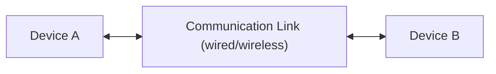

**Why networks exist:**

- Resource sharing (files, printers, storage)
- Communication (email, chat, video calls)
- Centralized data (databases, servers)
- Enabling the modern internet, cloud computing, and distributed systems

---

## 2. Types of Networks (by scale)

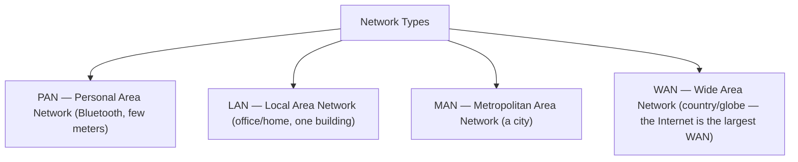


| Type | Range             | Example                          |
| ------ | ------------------- | ---------------------------------- |
| PAN  | A few meters      | Bluetooth headphones, smartwatch |
| LAN  | A building/campus | Office WiFi, home network        |
| MAN  | A city            | Cable TV network, city-wide WiFi |
| WAN  | Country/global    | The Internet itself              |

---

## 3. Network Topologies (how devices are physically/logically arranged)

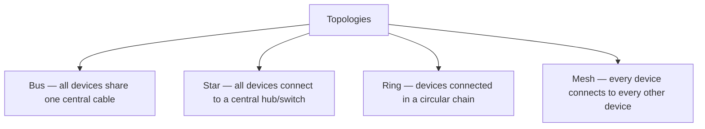

**Star topology** is the most common in modern LANs (every device connects to a central switch) — a single cable failure only affects one device, not the whole network.

---

## 4. OSI Model — 7 Layers (THE most important networking interview topic)

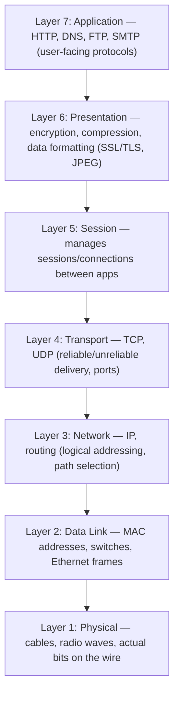

**Mnemonic:** "**A**ll **P**eople **S**eem **T**o **N**eed **D**ata **P**rocessing" (Application → Physical)


| Layer           | Deals with                    | Examples                          |
| ----------------- | ------------------------------- | ----------------------------------- |
| 7. Application  | User-facing protocols         | HTTP, HTTPS, DNS, FTP, SMTP       |
| 6. Presentation | Data format, encryption       | SSL/TLS, JPEG, encoding           |
| 5. Session      | Managing connections/sessions | APIs session handling             |
| 4. Transport    | End-to-end delivery           | TCP, UDP, ports                   |
| 3. Network      | Logical addressing, routing   | IP, ICMP, routers                 |
| 2. Data Link    | Physical addressing (local)   | MAC address, switches, Ethernet   |
| 1. Physical     | Raw bits, cables, signals     | Ethernet cables, WiFi radio waves |

> **Interview line:** "The OSI model is a conceptual framework — real-world networking (like the Internet) actually runs on the simpler 4-layer TCP/IP model, but OSI is still the standard teaching/reference model."

---

## 5. TCP/IP Model (the model the real Internet actually uses)

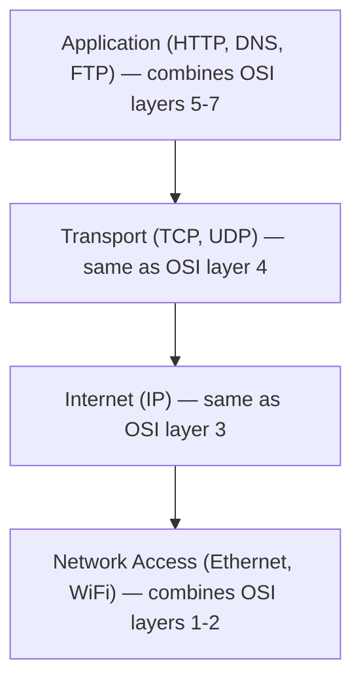

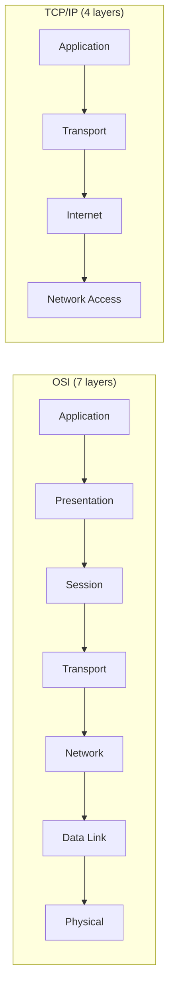

---

## 6. Data Encapsulation (as data travels down the layers)

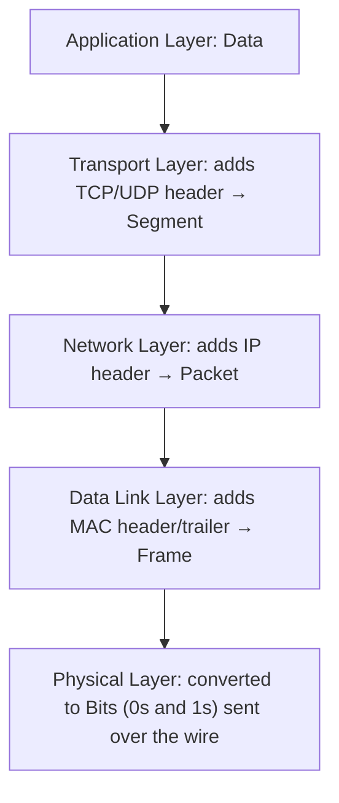

Each layer wraps the previous layer's output with its own header (like nested envelopes) — this is called **encapsulation**. The receiving side reverses the process (**decapsulation**).

---

# PART 2: Addressing

## 7. IP Address — What and Why

**An IP address uniquely identifies a device on a network (Layer 3 — logical/routable address).**

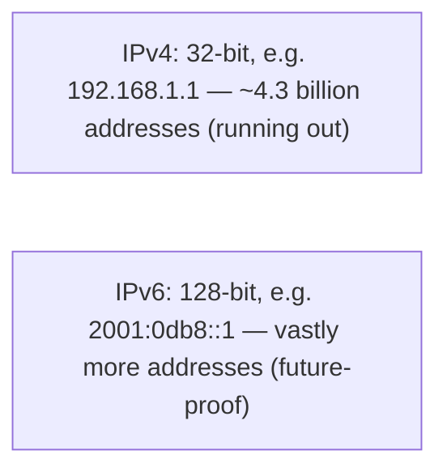

### Public vs Private IP

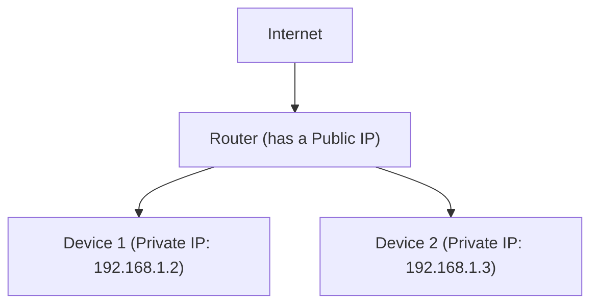


|            | Public IP                        | Private IP                                      |
| ------------ | ---------------------------------- | ------------------------------------------------- |
| Visibility | Routable/visible on the internet | Only visible within local network               |
| Ranges     | Assigned by ISPs                 | `10.0.0.0/8`, `172.16.0.0/12`, `192.168.0.0/16` |
| Uniqueness | Globally unique                  | Can be reused across different private networks |

### NAT (Network Address Translation) — how multiple private devices share one public IP

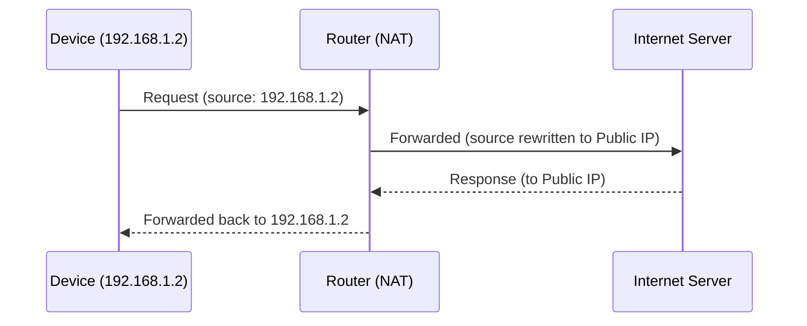

> **Interview line:** "NAT lets an entire private network share a single public IP address, which is why running out of IPv4 addresses hasn't broken the internet — NAT extends its usable lifespan."

---

## 8. MAC Address vs IP Address


|             | MAC Address                             | IP Address                   |
| ------------- | ----------------------------------------- | ------------------------------ |
| Layer       | Data Link (Layer 2)                     | Network (Layer 3)            |
| Scope       | Local network only                      | Global/routable              |
| Assigned by | Hardware manufacturer (burned into NIC) | Network/DHCP (can change)    |
| Format      | `00:1A:2B:3C:4D:5E` (48-bit)            | `192.168.1.1` (32-bit IPv4)  |
| Analogy     | Your permanent name                     | Your current mailing address |

---

## 9. DHCP — Dynamic Host Configuration Protocol

Automatically assigns IP addresses to devices joining a network (so you don't manually configure each device).

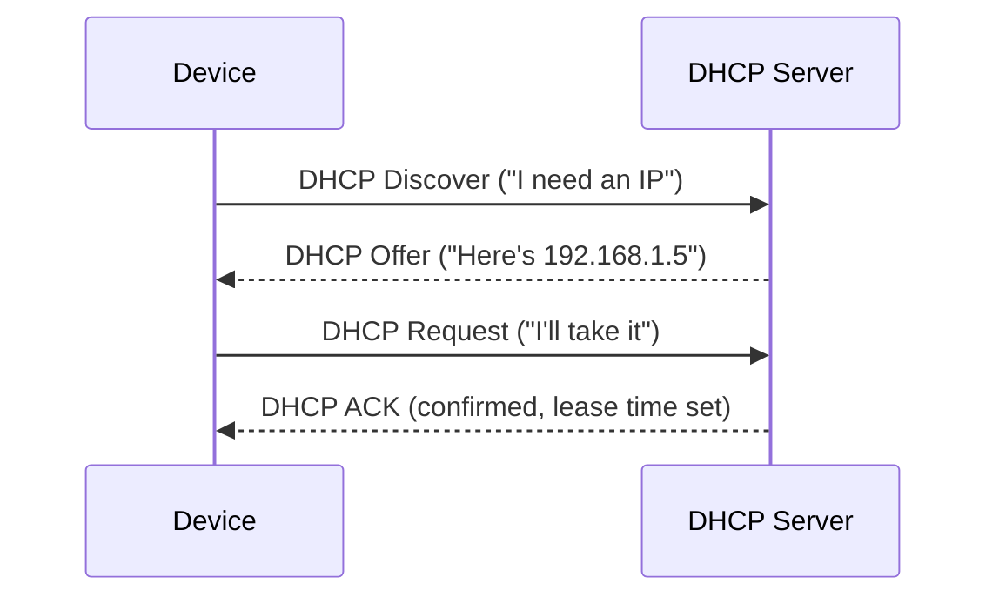

---

## 10. Ports and Sockets

**A port identifies a specific application/service running on a device (0–65535).**

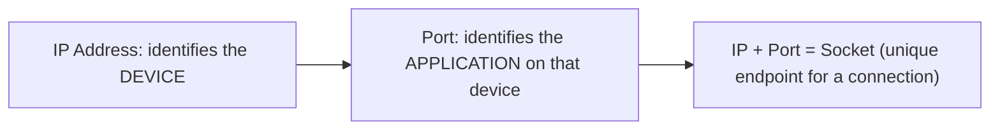

### Common Ports (memorize these — asked constantly)


| Port  | Service                       |
| ------- | ------------------------------- |
| 20/21 | FTP                           |
| 22    | SSH                           |
| 23    | Telnet                        |
| 25    | SMTP (email sending)          |
| 53    | DNS                           |
| 80    | HTTP                          |
| 443   | HTTPS                         |
| 3306  | MySQL                         |
| 5432  | PostgreSQL                    |
| 6379  | Redis                         |
| 27017 | MongoDB                       |
| 8080  | Common alt-HTTP (dev servers) |

---

# PART 3: Transport Layer — TCP vs UDP

## 11. TCP (Transmission Control Protocol)

**Connection-oriented, reliable, ordered delivery.**

### The TCP Three-Way Handshake (VERY frequently asked — draw this exactly)

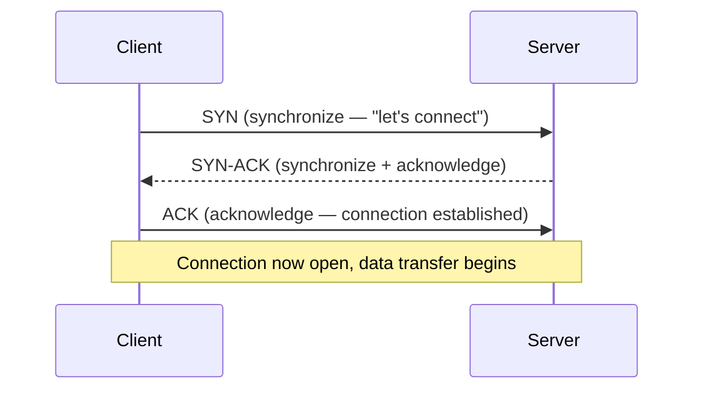

**Connection termination (four-way handshake):**

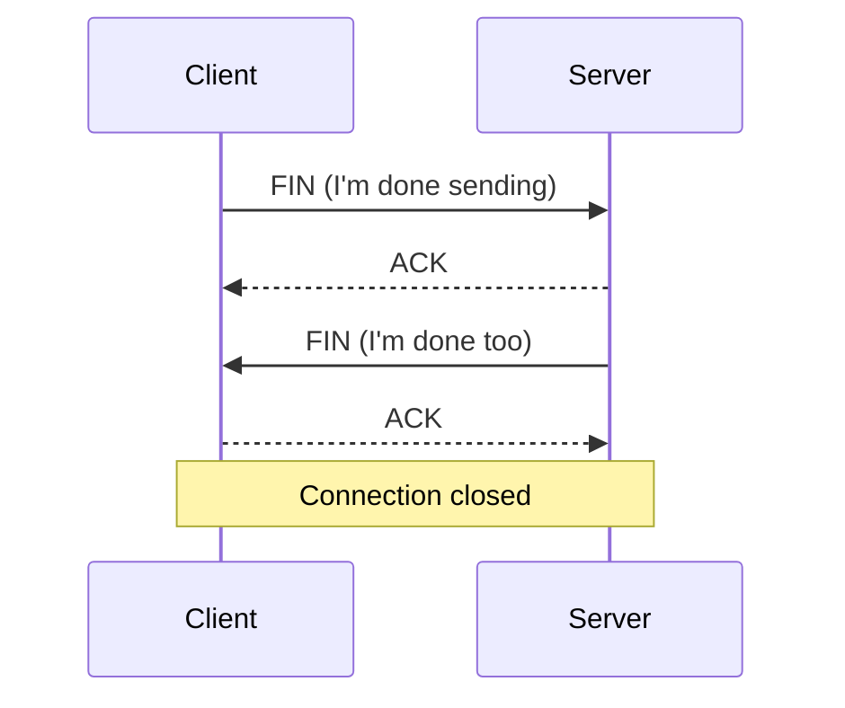

### TCP Guarantees

- Reliable delivery (retransmits lost packets)
- Ordered delivery (packets reassembled in correct sequence)
- Error checking (checksums)
- Flow control & congestion control

---

## 12. UDP (User Datagram Protocol)

**Connectionless, fast, no delivery guarantee — "fire and forget."**

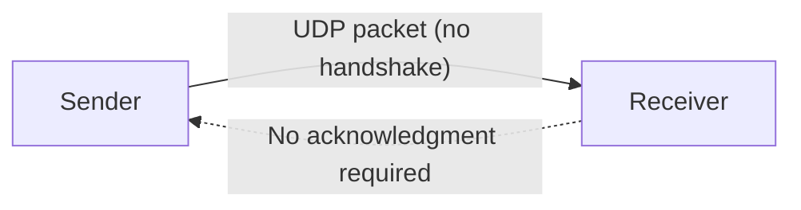

### TCP vs UDP (extremely common interview comparison)


|             | TCP                                       | UDP                                |
| ------------- | ------------------------------------------- | ------------------------------------ |
| Connection  | Connection-oriented (handshake)           | Connectionless                     |
| Reliability | Guaranteed delivery, retransmits          | No guarantee, packets can be lost  |
| Order       | Preserves order                           | No ordering guarantee              |
| Speed       | Slower (overhead of guarantees)           | Faster (minimal overhead)          |
| Use cases   | Web browsing (HTTP), email, file transfer | Video streaming, gaming, DNS, VoIP |

> **Interview line:** "TCP trades speed for reliability — good for things where every byte matters (a webpage, a file). UDP trades reliability for speed — good for real-time things where a dropped frame is better than a delayed one, like video calls or live gaming."

---

# PART 4: DNS, HTTP, and Web-Layer Networking (Web focus)

## 13. DNS — In Depth (builds on earlier notes, now with resolution steps)

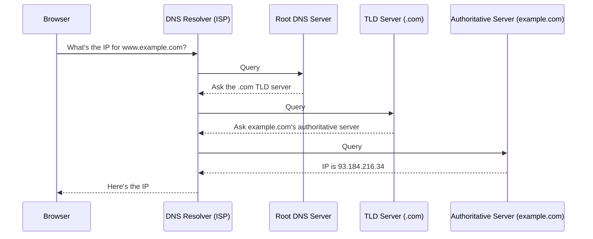

Once resolved, the result is **cached** (by browser, OS, or resolver) for a duration set by the DNS record's **TTL (Time To Live)** — so repeated lookups don't repeat this whole chain.

### Common DNS Record Types


| Record | Purpose                                                       |
| -------- | --------------------------------------------------------------- |
| A      | Maps domain → IPv4 address                                   |
| AAAA   | Maps domain → IPv6 address                                   |
| CNAME  | Alias — maps domain → another domain                        |
| MX     | Mail server for the domain                                    |
| TXT    | Arbitrary text (often used for domain verification, SPF/DKIM) |
| NS     | Specifies the authoritative name servers                      |

---

## 14. HTTP/HTTPS Recap + TLS Handshake (deep dive — very DevOps/security relevant)

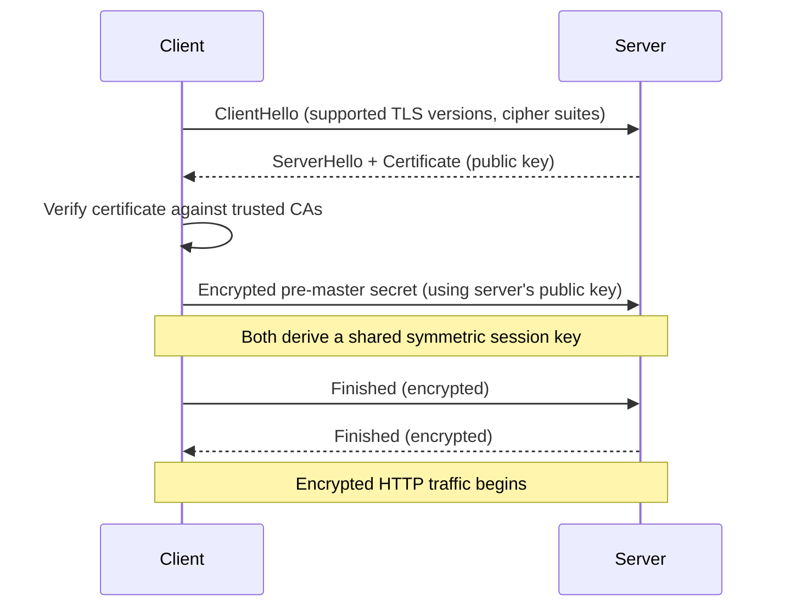

**Why symmetric encryption after the handshake?** Asymmetric (public/private key) encryption is computationally expensive — so TLS uses it only to safely exchange a symmetric session key, then switches to fast symmetric encryption for the actual data.

---

## 15. HTTP/1.1 vs HTTP/2 vs HTTP/3 (good to know for modern web/DevOps interviews)

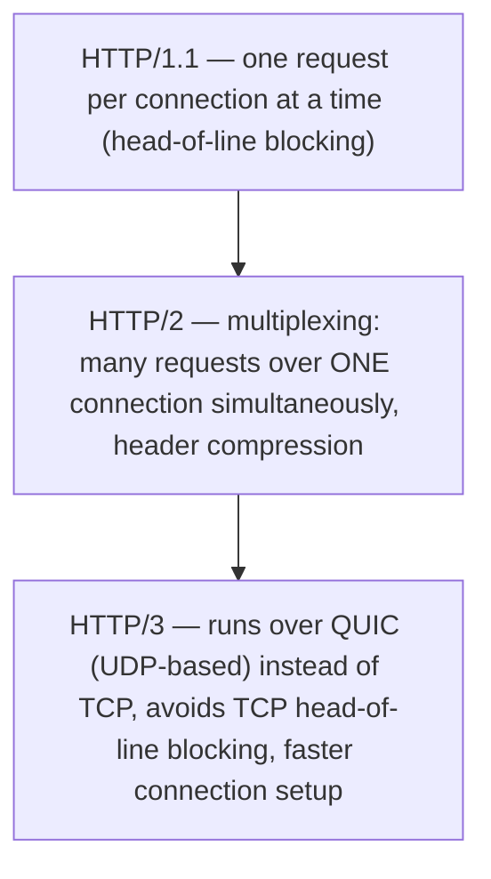

---

## 16. WebSockets — Real-Time Communication (Web-specific, interview-relevant)

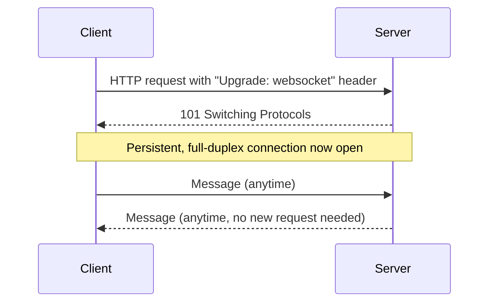


|            | HTTP Polling                               | WebSockets                                                        |
| ------------ | -------------------------------------------- | ------------------------------------------------------------------- |
| Connection | New request every time (repeated overhead) | One persistent connection                                         |
| Direction  | Client always initiates                    | Both client AND server can send anytime                           |
| Use case   | Simple periodic checks                     | Chat apps, live notifications, live dashboards, multiplayer games |

---

# PART 5: Network Infrastructure Devices

## 17. Hub vs Switch vs Router (classic layered comparison)

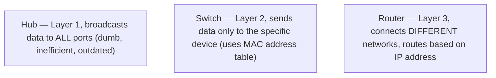


| Device | Layer         | Behavior                                                                   |
| -------- | --------------- | ---------------------------------------------------------------------------- |
| Hub    | 1 (Physical)  | Broadcasts to all ports — obsolete today                                  |
| Switch | 2 (Data Link) | Learns MAC addresses, sends data only to the correct port                  |
| Router | 3 (Network)   | Connects separate networks (e.g., your LAN to the Internet), routes via IP |

---

## 18. Firewalls

**A firewall filters incoming/outgoing traffic based on defined security rules.**

```mermaid
flowchart LR
    Internet["Internet (untrusted)"] --> FW["Firewall (rule-based filter)"]
    FW -->|"Allowed traffic"| Internal["Internal Network"]
    FW -.->|"Blocked traffic"| Reject["Rejected/Dropped"]
```

Types: **Packet-filtering** (checks IP/port rules), **Stateful** (tracks connection state), **Application-layer / WAF** (inspects actual HTTP content — blocks SQL injection, XSS, etc.)

---

## 19. Proxy vs Reverse Proxy (heavily asked in DevOps interviews)

```mermaid
flowchart LR
    subgraph Forward["Forward Proxy"]
        C1["Client"] --> FP["Proxy"] --> S1["Internet/Server"]
    end
```

Forward proxy sits **in front of clients** — hides the client's identity from the server (e.g., corporate proxy, VPN).

```mermaid
flowchart LR
    subgraph Reverse["Reverse Proxy"]
        C2["Client"] --> RP["Reverse Proxy (e.g., Nginx)"] --> S2["Backend Server(s)"]
    end
```

Reverse proxy sits **in front of servers** — hides backend server details from the client, and commonly handles load balancing, SSL termination, caching, and security.


|                  | Forward Proxy                  | Reverse Proxy              |
| ------------------ | -------------------------------- | ---------------------------- |
| Sits in front of | Clients                        | Servers                    |
| Hides            | The client from the server     | The server from the client |
| Common tools     | Squid, corporate proxies, VPNs | Nginx, HAProxy, AWS ALB    |

---

## 20. Load Balancers (essential DevOps topic)

```mermaid
flowchart TD
    Client["Incoming Traffic"] --> LB["Load Balancer"]
    LB --> S1["Server 1"]
    LB --> S2["Server 2"]
    LB --> S3["Server 3"]
```

**Why:** Distributes traffic across multiple servers → improves availability, scalability, and fault tolerance (if one server dies, traffic reroutes to healthy ones).

### Common Algorithms


| Algorithm            | How it works                                                                     |
| ---------------------- | ---------------------------------------------------------------------------------- |
| Round Robin          | Requests distributed sequentially, one to each server in turn                    |
| Least Connections    | Sends new request to the server with fewest active connections                   |
| IP Hash              | Same client IP always routes to the same server (useful for session persistence) |
| Weighted Round Robin | Servers with more capacity get proportionally more requests                      |

### L4 vs L7 Load Balancing

```mermaid
flowchart LR
    L4["Layer 4 LB — routes based on IP + Port (fast, doesn't inspect content)"]
    L7["Layer 7 LB — routes based on HTTP content (URL path, headers, cookies) — smarter but slower"]
```

---

## 21. CDN — Content Delivery Network (Web + DevOps + AI relevant)

```mermaid
flowchart TD
    Origin["Origin Server (e.g., in US)"] --> Edge1["Edge Server (Europe)"]
    Origin --> Edge2["Edge Server (Asia)"]
    Origin --> Edge3["Edge Server (India)"]
    UserIndia["User in India"] --> Edge3
```

**A CDN caches static content (images, CSS, JS, videos) at edge servers physically closer to users**, drastically reducing latency compared to fetching everything from a single distant origin server. Also reduces origin server load and improves resilience against traffic spikes (and some DDoS attacks).

---

## 22. VPN — Virtual Private Network

```mermaid
flowchart LR
    Device["Your Device"] -->|"Encrypted Tunnel"| VPNServer["VPN Server"] --> Internet["Internet"]
```

Creates an encrypted tunnel between your device and a VPN server, masking your real IP and encrypting traffic — commonly used for privacy, and in DevOps for securely accessing private cloud/company networks (e.g., connecting to a private VPC).

---

# PART 6: DevOps-Specific Networking

## 23. Container Networking (Docker)

```mermaid
flowchart TD
    Host["Host Machine"] --> Bridge["Docker Bridge Network (default)"]
    Bridge --> C1["Container 1"]
    Bridge --> C2["Container 2"]
    C1 <-->|"Can communicate via container names"| C2
```


| Docker network mode | Behavior                                                                         |
| --------------------- | ---------------------------------------------------------------------------------- |
| `bridge` (default)  | Isolated network, containers communicate via internal DNS (container names)      |
| `host`              | Container shares the host's network stack directly (no isolation)                |
| `none`              | No networking at all                                                             |
| `overlay`           | Spans multiple Docker hosts — used in Docker Swarm for multi-host communication |

---

## 24. Kubernetes Networking Basics

```mermaid
flowchart TD
    Pod1["Pod 1 (has its own IP)"] --> Service["Service (stable virtual IP, load-balances across Pods)"]
    Pod2["Pod 2 (has its own IP)"] --> Service
    Service --> Ingress["Ingress (routes external HTTP traffic in, by path/host)"]
    Ingress --> ExternalUser["External User"]
```

**Key concepts:**

- **Pod:** smallest deployable unit, gets its own internal IP (ephemeral — changes on restart)
- **Service:** a stable network endpoint that load-balances traffic across a set of Pods (since Pod IPs change)
- **Ingress:** manages external access to Services, typically HTTP/HTTPS routing based on hostname/path

> **Interview line:** "Pods are ephemeral, so you never talk to a Pod's IP directly in production — a Service gives you a stable DNS name/IP that automatically load-balances across healthy Pods, even as they're recreated."

---

## 25. CI/CD and Networking

```mermaid
flowchart LR
    Dev["Developer pushes code"] --> Repo["Git Repository (GitHub)"]
    Repo -->|"Webhook (HTTP POST)"| CI["CI/CD Server (Jenkins/GitHub Actions)"]
    CI --> Build["Build & Test"]
    Build --> Deploy["Deploy to Server(s) — often over SSH or an API call"]
```

- **Webhooks:** HTTP callbacks — GitHub notifies your CI server the moment code is pushed
- **SSH (port 22):** commonly used to securely deploy to remote servers
- **API calls:** cloud providers (AWS, GCP, Azure) are configured/deployed to almost entirely via HTTPS API calls

---

## 26. Cloud Networking Essentials (AWS-flavored, but concepts are universal)

```mermaid
flowchart TD
    VPC["VPC — Virtual Private Cloud (your isolated network in the cloud)"] --> Public["Public Subnet — has internet access (web servers)"]
    VPC --> Private["Private Subnet — no direct internet access (databases)"]
    Public --> IGW["Internet Gateway"]
    Private --> NATGW["NAT Gateway (outbound-only internet access)"]
```


| Concept              | Purpose                                                                                                                          |
| ---------------------- | ---------------------------------------------------------------------------------------------------------------------------------- |
| **VPC**              | Your own isolated virtual network within the cloud                                                                               |
| **Subnet**           | A segment of the VPC — public (internet-facing) or private (internal only)                                                      |
| **Security Group**   | Instance-level firewall (stateful — allows return traffic automatically)                                                        |
| **NACL**             | Subnet-level firewall (stateless — must explicitly allow both directions)                                                       |
| **Internet Gateway** | Allows a VPC to communicate with the public internet                                                                             |
| **NAT Gateway**      | Lets private subnet resources reach the internet OUTBOUND only (e.g., to download updates), without being reachable from outside |

---

# PART 7: AI/ML-Specific Networking Considerations

## 27. Why Networking Matters for AI/ML Workloads

```mermaid
flowchart TD
    AI["AI/ML Networking Concerns"] --> Train["Distributed Training — nodes must exchange gradients FAST"]
    AI --> Infer["Model Inference APIs — low-latency request/response"]
    AI --> Data["Data Pipeline — moving large datasets between storage and compute"]
    AI --> Edge["Edge AI — running models closer to users to reduce latency"]
```

### Distributed Training Networking

```mermaid
flowchart LR
    N1["GPU Node 1"] <-->|"High-bandwidth interconnect"| N2["GPU Node 2"]
    N2 <-->|"e.g. InfiniBand / NVLink / high-speed Ethernet"| N3["GPU Node 3"]
```

- Multi-GPU/multi-node training requires synchronizing model weights/gradients across nodes (e.g., via **all-reduce** operations) — this demands **very high bandwidth, low latency** interconnects (InfiniBand, NVLink), since network speed can become the bottleneck, not compute.
- Cloud AI training clusters are often placed in the same data center/availability zone specifically to minimize this network latency.

### Serving/Inference APIs

```mermaid
sequenceDiagram
    participant App as Your App
    participant API as Model Inference API (e.g., Claude API)
    App->>API: HTTPS POST request (prompt/data)
    API-->>App: HTTPS Response (model output)
    Note over App,API: Latency here directly affects user experience
```

- Model APIs are typically consumed over **HTTPS** (REST) — same fundamentals as any web API: DNS resolution, TCP handshake, TLS handshake, then the actual request/response.
- **Streaming responses** (like token-by-token LLM output) often use **HTTP chunked transfer encoding** or **Server-Sent Events (SSE)** — related to, but simpler than, full WebSockets, since data only flows server → client.
- **Latency matters a lot** for real-time AI applications (chatbots, voice assistants) — this is why CDNs, edge inference, and geographically distributed API endpoints matter for AI products, just like for regular web apps.

### Data Pipelines

- Training data often lives in object storage (like S3) — moving terabytes of data for training requires high-throughput networking, and cloud providers charge for data egress (transferring data OUT of their network), which is a real cost consideration in ML infrastructure design.

---

## 28. REST API Networking Basics (ties Web + AI together)

```mermaid
flowchart LR
    Client["Client"] -->|"HTTPS Request: Method + Endpoint + Headers + Body"| API["REST API Server"]
    API -->|"HTTPS Response: Status Code + Headers + JSON Body"| Client
```

- Almost all modern web APIs (including AI model APIs) follow this same REST-over-HTTPS pattern
- **Authentication** commonly uses an `Authorization: Bearer <token>` header (API keys, JWTs) — sent with every request since HTTP itself is stateless
- **Rate limiting** (HTTP 429 Too Many Requests) protects backend/API infrastructure from overload — very relevant when calling AI APIs at scale

---

## 29. Complete Mental Model — Networking Across All Three Domains

```mermaid
flowchart TD
    Fund["Networking Fundamentals (OSI/TCP-IP, DNS, TCP/UDP, IP addressing)"] --> Web["Web: HTTP/HTTPS, WebSockets, CDN, TLS"]
    Fund --> DevOps["DevOps: Docker/K8s networking, Load Balancers, VPC, CI/CD webhooks"]
    Fund --> AI["AI: Distributed training interconnects, Inference APIs, Streaming responses, Data pipeline bandwidth"]
```

---

## Quick-Fire Interview Q&A (Flashcard style)

```python
# Cover the answer, try to recall it first, then check.

Q1 = "What are the 7 layers of the OSI model, top to bottom?"
A1 = "Application, Presentation, Session, Transport, Network, Data Link, Physical. Mnemonic: 'All People Seem To Need Data Processing'."

Q2 = "Explain the TCP three-way handshake."
A2 = "SYN (client requests connection) -> SYN-ACK (server acknowledges and requests back) -> ACK (client confirms). After this, the connection is established and data transfer begins."

Q3 = "TCP vs UDP — when would you use each?"
A3 = "TCP for reliability-critical data (web pages, file transfer, email) — it guarantees ordered, complete delivery. UDP for speed-critical, loss-tolerant data (video calls, live gaming, DNS) — it skips the overhead of guarantees."

Q4 = "What is NAT and why does it matter?"
A4 = "Network Address Translation lets many devices on a private network share a single public IP address, translating between private and public addresses at the router — this is a big reason IPv4 address exhaustion hasn't broken the internet."

Q5 = "Forward proxy vs reverse proxy?"
A5 = "A forward proxy sits in front of CLIENTS and hides the client from the server (e.g., corporate proxy/VPN). A reverse proxy sits in front of SERVERS and hides backend details from the client, often also handling load balancing and SSL termination (e.g., Nginx)."

Q6 = "Why do Kubernetes Services exist if Pods already have IPs?"
A6 = "Pod IPs are ephemeral — they change when Pods restart or reschedule. A Service provides a STABLE virtual IP/DNS name that load-balances traffic across the current set of healthy Pods, so clients never need to track individual Pod IPs."

Q7 = "What's the difference between a Security Group and a NACL in AWS?"
A7 = "Security Groups are stateful and instance-level (return traffic is automatically allowed). NACLs are stateless and subnet-level (you must explicitly allow both inbound AND outbound rules)."

Q8 = "Why is networking bandwidth a bottleneck in distributed AI training?"
A8 = "Multi-GPU/multi-node training requires constantly synchronizing gradients/weights across nodes (e.g., via all-reduce). If the interconnect (network) is slower than the GPUs can compute, the network becomes the bottleneck instead of raw compute power — this is why high-speed interconnects like InfiniBand or NVLink matter."

Q9 = "How does an LLM's streaming response (token by token) typically work at the network level?"
A9 = "Usually via HTTP chunked transfer encoding or Server-Sent Events (SSE) over a single HTTPS connection — the server keeps the response open and pushes tokens as they're generated, rather than waiting to send the full response at once."

Q10 = "Why does a CDN help both a web app AND an AI product?"
A10 = "It caches static content (or serves inference at edge locations) physically closer to the user, cutting round-trip latency — critical for both fast page loads on the web AND responsive real-time AI experiences like voice assistants or chatbots."
```

---

## One-Line Summary

> **"Networking is the invisible layer connecting every system you build — from the TCP handshake underneath every web request, to the load balancers and Kubernetes Services that keep DevOps infrastructure resilient, to the high-bandwidth interconnects that make distributed AI training and low-latency inference possible."**

### Final Takeaways Checklist

- ✅ OSI (7 layers, conceptual) vs TCP/IP (4 layers, what the real internet uses)
- ✅ IP address (Layer 3, routable) vs MAC address (Layer 2, local hardware)
- ✅ TCP = reliable + ordered (3-way handshake); UDP = fast + no guarantees
- ✅ DNS resolution chain: Resolver → Root → TLD → Authoritative server
- ✅ TLS handshake exchanges keys asymmetrically, then switches to fast symmetric encryption
- ✅ Reverse proxy (Nginx) commonly handles load balancing + SSL termination + caching
- ✅ Load balancer algorithms: Round Robin, Least Connections, IP Hash; L4 (IP/port) vs L7 (HTTP content)
- ✅ Docker: bridge (default, isolated) vs host vs overlay networking
- ✅ Kubernetes: Pods are ephemeral → Services provide stable networking → Ingress routes external traffic
- ✅ Cloud VPC: public subnet (Internet Gateway) vs private subnet (NAT Gateway, outbound-only)
- ✅ Distributed AI training is often network-bound, not compute-bound — interconnect speed matters as much as GPU power
- ✅ AI inference APIs follow standard REST-over-HTTPS patterns; streaming uses SSE/chunked transfer, not full WebSockets

---

*Complete Computer Networks reference notes — from fundamentals to Web/DevOps/AI-specific applications, for interview prep & quick revision.*
