# Web Fundamentals + HTML — Complete Notes (Basic to Advanced)

> From "what is the Web" all the way to advanced HTML5 — organized with diagrams for interview prep and deep understanding.

---

# PART 1: Web & Internet Fundamentals

## 1. Internet vs Web vs Browser (commonly confused — classic interview question)

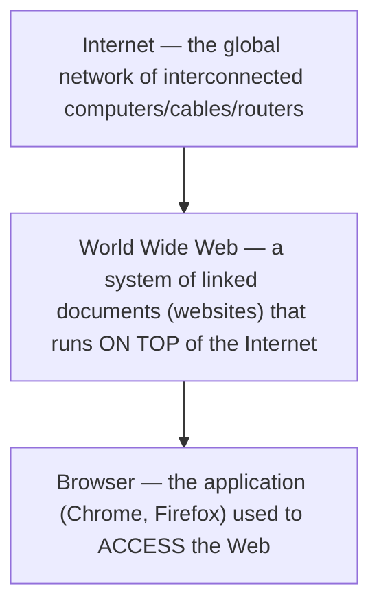


| Term          | What it actually is                                                                                |
| --------------- | ---------------------------------------------------------------------------------------------------- |
| **Internet**  | The physical/logical network — cables, routers, servers connecting billions of devices            |
| **Web (WWW)** | A service that runs on the Internet — a collection of documents (web pages) linked via hyperlinks |
| **Browser**   | Software that lets you request and render web pages (Chrome, Firefox, Safari)                      |

Other things that use the Internet but are NOT "the Web": email (SMTP), file transfer (FTP), video calls, gaming servers.

---

## 2. Client-Server Model

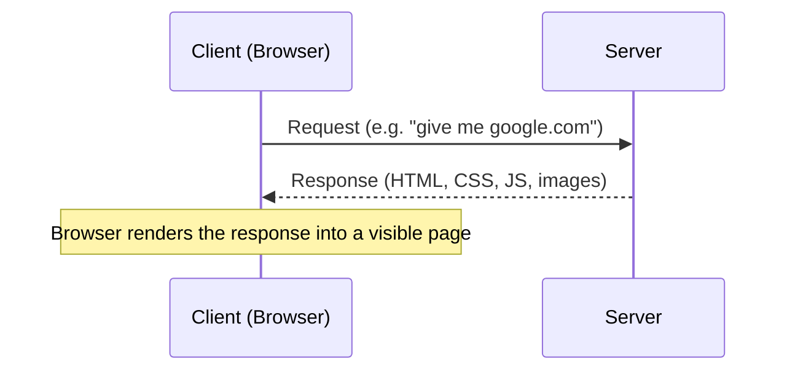

- **Client:** requests resources (your browser/device)
- **Server:** stores and serves resources (a powerful computer running 24/7, hosting websites/data)

---

## 3. What Happens When You Type a URL and Press Enter? (VERY common interview question)

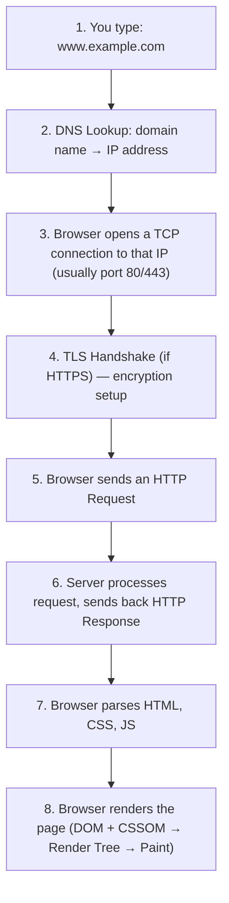

---

## 4. DNS (Domain Name System) — "The Internet's Phonebook"

Computers communicate using **IP addresses** (e.g., `142.250.183.14`), but humans use names (e.g., `google.com`). DNS translates one into the other.

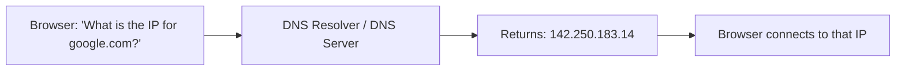

---

## 5. Anatomy of a URL

```
https://www.example.com:443/products/shoes?color=red&size=9#reviews
```


| Part                | Meaning                                                             |
| --------------------- | --------------------------------------------------------------------- |
| `https://`          | Protocol/scheme (how to communicate)                                |
| `www.example.com`   | Domain / host                                                       |
| `:443`              | Port (443 = HTTPS default, 80 = HTTP default; usually hidden)       |
| `/products/shoes`   | Path (specific resource on the server)                              |
| `?color=red&size=9` | Query string (parameters)                                           |
| `#reviews`          | Fragment/anchor (jumps to a section on the page, browser-side only) |

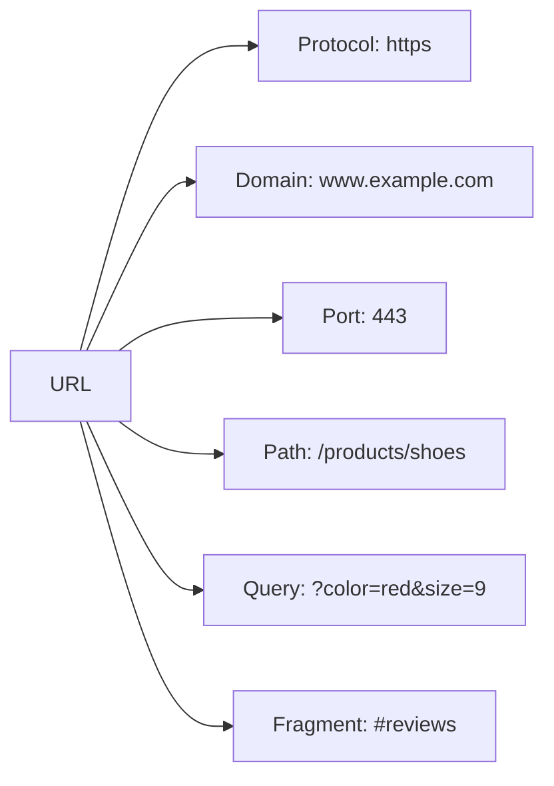

---

## 6. HTTP — HyperText Transfer Protocol

**HTTP is the language/protocol browsers and servers use to talk to each other.**

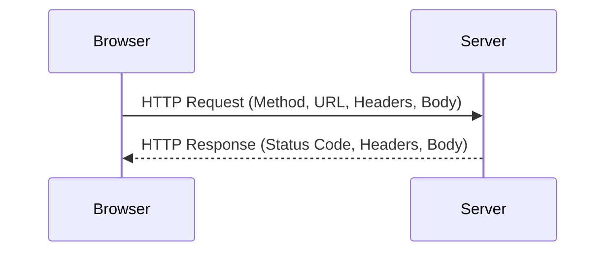

### HTTP Request — Structure

```
GET /index.html HTTP/1.1
Host: www.example.com
User-Agent: Mozilla/5.0
Accept: text/html
```

### HTTP Response — Structure

```
HTTP/1.1 200 OK
Content-Type: text/html
Content-Length: 1256

<html>...</html>
```

### Common HTTP Methods


| Method   | Purpose                                                      |
| ---------- | -------------------------------------------------------------- |
| `GET`    | Retrieve data (no side effects, e.g., loading a page)        |
| `POST`   | Submit new data (e.g., form submission, creating a resource) |
| `PUT`    | Update/replace an existing resource entirely                 |
| `PATCH`  | Partially update a resource                                  |
| `DELETE` | Remove a resource                                            |

### Common HTTP Status Codes (must-know for interviews)

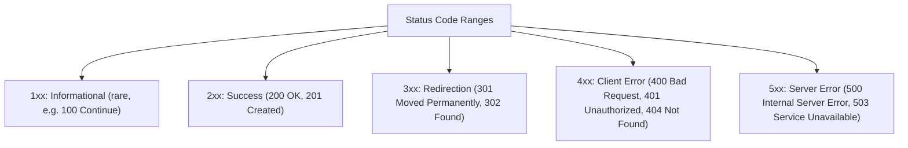

---

## 7. HTTP vs HTTPS

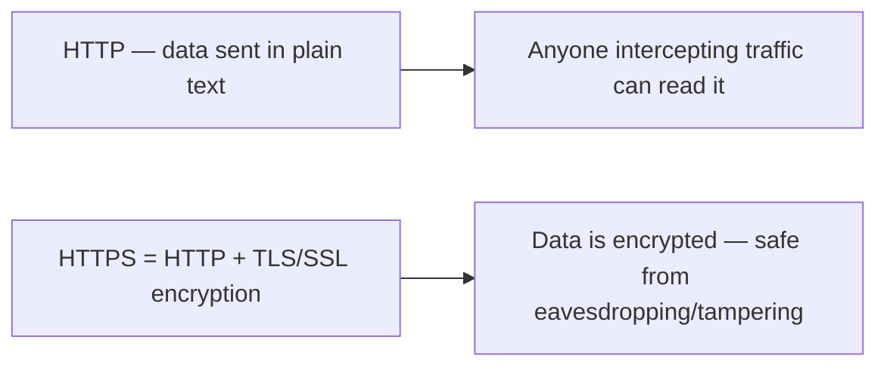

HTTPS adds a **TLS handshake** before the actual HTTP conversation, establishing an encrypted channel using certificates.

---

## 8. Frontend vs Backend (context before diving into HTML)

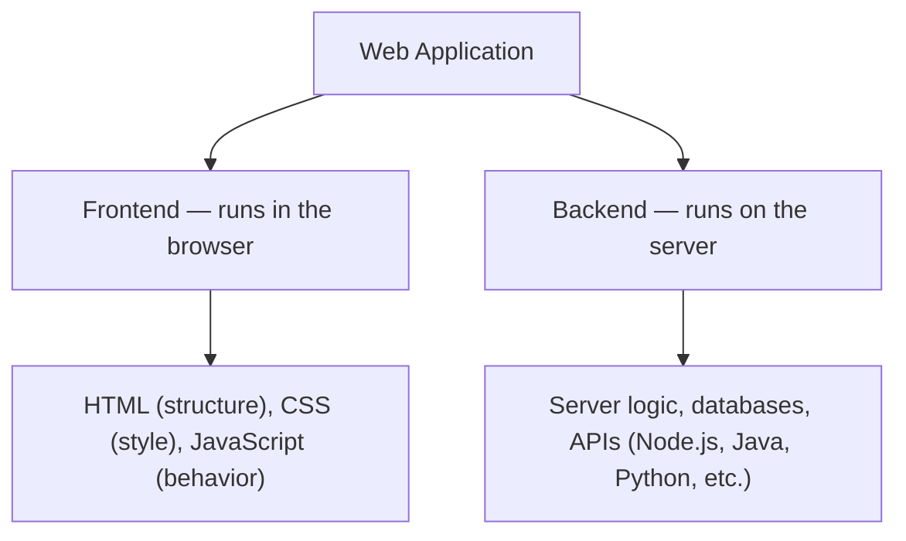

**HTML is the very first building block of the frontend — it defines the structure/content of a web page.**

---

# PART 2: HTML — From Basics to Advanced

## 9. What is HTML?

**HTML = HyperText Markup Language.**

- **HyperText** → text containing links to other text/pages
- **Markup Language** → uses tags to describe/structure content (not a programming language — no logic/loops/conditions)

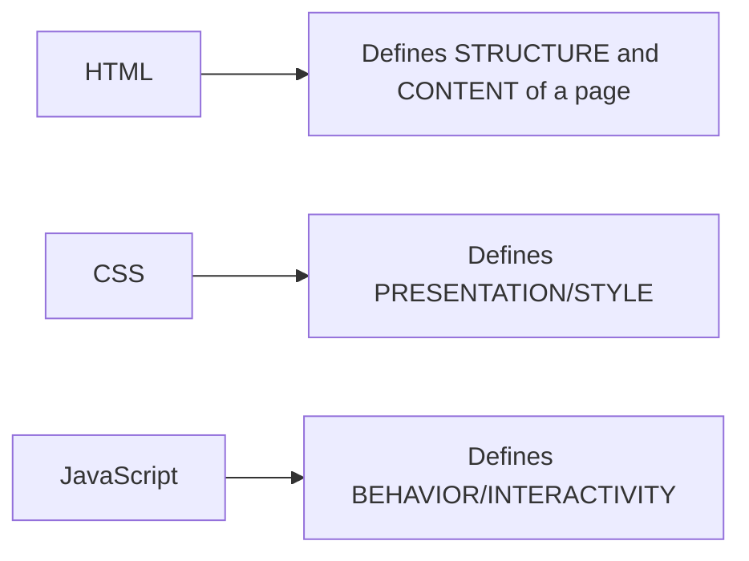

> **Interview line:** "HTML is a markup language, not a programming language — it has no variables, conditionals, or loops. It only describes structure."

---

## 10. Basic HTML Document Structure

```html
<!DOCTYPE html>
<html lang="en">
<head>
    <meta charset="UTF-8">
    <meta name="viewport" content="width=device-width, initial-scale=1.0">
    <title>My First Page</title>
</head>
<body>
    <h1>Hello World</h1>
    <p>This is a paragraph.</p>
</body>
</html>
```

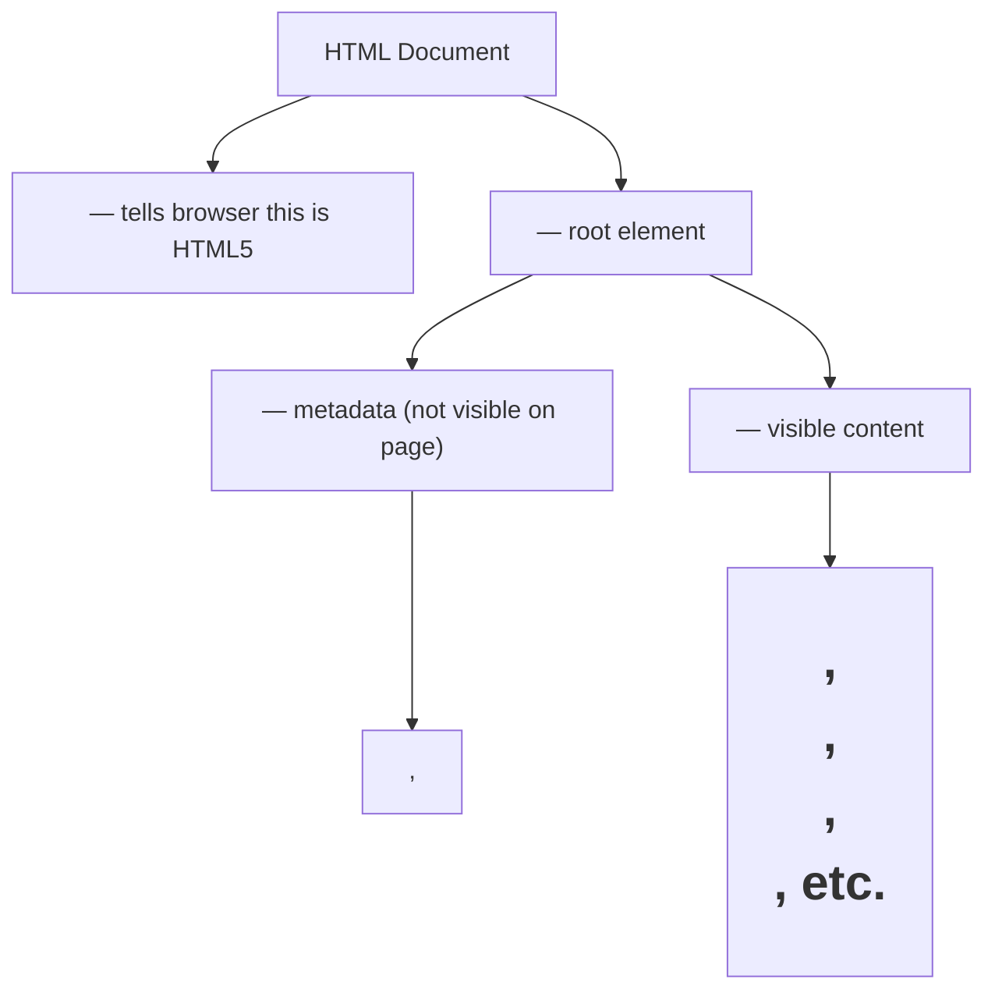


| Tag               | Purpose                                                      |
| ------------------- | -------------------------------------------------------------- |
| `<!DOCTYPE html>` | Declares HTML5 document type                                 |
| `<html>`          | Root element, wraps everything                               |
| `<head>`          | Contains metadata: title, charset, links to CSS/JS, SEO tags |
| `<body>`          | Contains everything visible to the user                      |

---

## 11. Tags, Elements, and Attributes (terminology interview trap)

```
<a href="https://example.com" target="_blank">Click here</a>
 └tag┘  └────────attribute──────────┘          └────tag────┘
 └──────────────────element─────────────────────┘
```


| Term          | Meaning                                                               |
| --------------- | ----------------------------------------------------------------------- |
| **Tag**       | The markup itself, e.g.`<a>` (opening) and `</a>` (closing)           |
| **Element**   | The tag + its content + attributes together                           |
| **Attribute** | Extra info added inside the opening tag (`href`, `class`, `id`, etc.) |

Some tags are **self-closing / void elements** (no content, no closing tag): `<br>`, ``, `<hr>`, `<input>`, `<meta>`.

---

## 12. Text Content Elements

```html
<h1>Heading 1 (largest)</h1>
<h2>Heading 2</h2>
...
<h6>Heading 6 (smallest)</h6>

<p>A paragraph of text.</p>

<b>Bold (visual only)</b>
<strong>Strong (bold + semantic importance)</strong>

<i>Italic (visual only)</i>
<em>Emphasis (italic + semantic emphasis)</em>

<br>  <!-- line break -->
<hr>  <!-- horizontal rule/divider -->
```

**Interview trap:** `<b>` vs `<strong>`, and `<i>` vs `<em>` — the first pair is purely visual, the second pair carries semantic meaning (important for accessibility and SEO, since screen readers treat them differently).

---

## 13. Lists

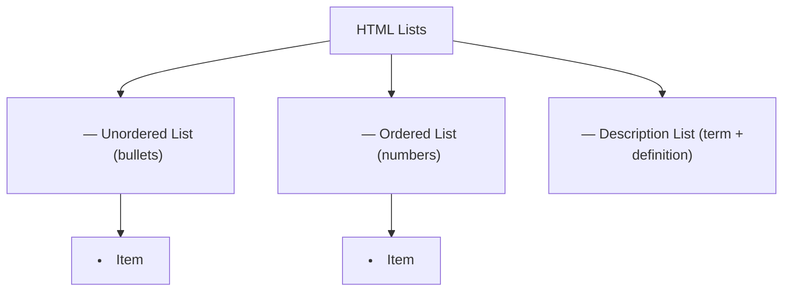

```html
<ul>
    <li>Tea</li>
    <li>Coffee</li>
</ul>

<ol>
    <li>Step 1</li>
    <li>Step 2</li>
</ol>

<dl>
    <dt>HTML</dt>
    <dd>HyperText Markup Language</dd>
</dl>
```

---

## 14. Links and Navigation

```html
<a href="https://example.com">External link</a>
<a href="/about">Internal link (relative path)</a>
<a href="#section2">Jump to section on same page</a>
<a href="mailto:someone@example.com">Send email</a>
<a href="tel:+911234567890">Call number</a>
<a href="https://example.com" target="_blank" rel="noopener noreferrer">Open in new tab</a>
```

> **Interview tip:** `target="_blank"` should be paired with `rel="noopener noreferrer"` for security — without it, the new page can access `window.opener` and potentially redirect your original tab (a known vulnerability called "tabnabbing").

---

## 15. Images

```html

```


| Attribute          | Purpose                                                                                                  |
| -------------------- | ---------------------------------------------------------------------------------------------------------- |
| `src`              | Path/URL to the image                                                                                    |
| `alt`              | Alternate text — shown if image fails to load, read by screen readers (crucial for accessibility & SEO) |
| `width` / `height` | Dimensions (helps prevent layout shift while loading)                                                    |

**Responsive images (advanced):**

```html
<picture>
    <source media="(min-width: 800px)" srcset="large.jpg">
    <source media="(max-width: 799px)" srcset="small.jpg">
    
</picture>
```

---

## 16. Tables

```html
<table>
    <thead>
        <tr>
            <th>Name</th>
            <th>Score</th>
        </tr>
    </thead>
    <tbody>
        <tr>
            <td>Dipan</td>
            <td>95</td>
        </tr>
    </tbody>
</table>
```

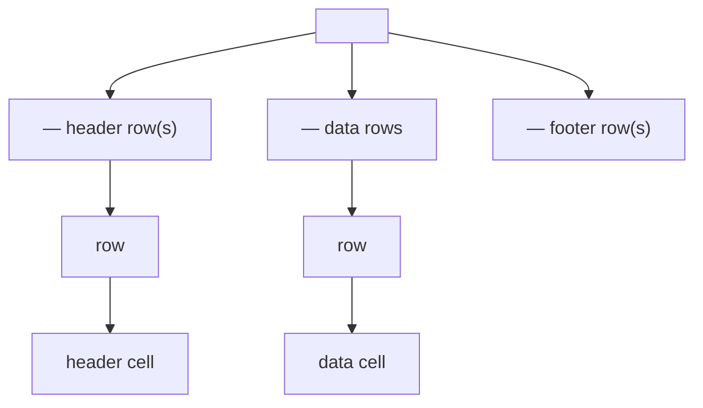

Merging cells: `colspan` (merge columns), `rowspan` (merge rows).

---

## 17. Forms — one of the most interview-tested topics

```html
<form action="/submit" method="POST">
    <label for="name">Name:</label>
    <input type="text" id="name" name="name" placeholder="Enter name" required>

    <label for="email">Email:</label>
    <input type="email" id="email" name="email" required>

    <label for="pass">Password:</label>
    <input type="password" id="pass" name="pass">

    <input type="radio" name="gender" value="male"> Male
    <input type="radio" name="gender" value="female"> Female

    <input type="checkbox" name="subscribe" value="yes"> Subscribe

    <select name="country">
        <option value="in">India</option>
        <option value="us">USA</option>
    </select>

    <textarea name="message" rows="4" cols="30"></textarea>

    <input type="submit" value="Submit">
    <button type="button">Cancel</button>
</form>
```

```mermaid
flowchart TD
    Form["<form action='/submit' method='POST'>"] --> Inputs["Input Elements"]
    Inputs --> Text["text, email, password, number, date, etc."]
    Inputs --> Choice["radio, checkbox, select"]
    Inputs --> Multi["textarea (multi-line)"]
    Inputs --> Submit["submit / button"]
    Form -->|"On submit"| Server["Data sent to server via GET or POST"]
```

### GET vs POST in forms (frequently asked)


|               | GET                               | POST                        |
| --------------- | ----------------------------------- | ----------------------------- |
| Data location | Appended to URL as query string   | Sent in the request body    |
| Visibility    | Visible in URL/browser history    | Hidden from URL             |
| Use case      | Search, filtering (non-sensitive) | Login, sensitive/large data |
| Data limit    | Limited by URL length             | No practical limit          |

### Common `<input>` types

`text`, `password`, `email`, `number`, `date`, `checkbox`, `radio`, `file`, `range`, `color`, `search`, `tel`, `url`.

### Validation attributes

`required`, `minlength`, `maxlength`, `pattern`, `min`, `max` — enable built-in browser validation without JavaScript.

---

## 18. Semantic HTML5 Elements (HUGE interview topic — accessibility + SEO)

**Before HTML5**, everything was a `<div>` with a class name (`<div class="header">`, `<div class="footer">`). **HTML5 introduced semantic tags** that describe *meaning*, not just appearance.

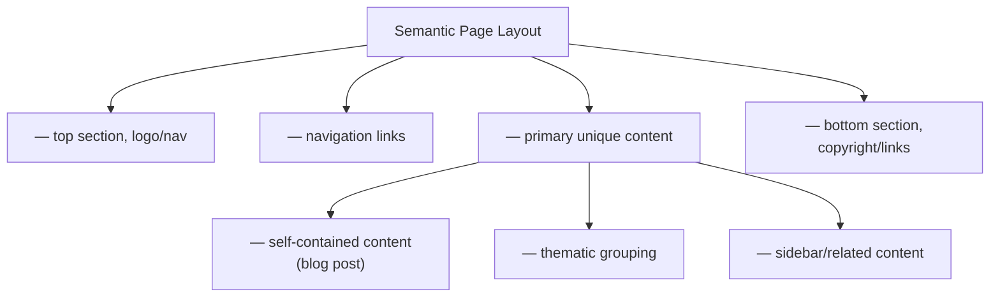

```html
<body>
    <header>
        <nav>...</nav>
    </header>
    <main>
        <article>
            <section>...</section>
        </article>
        <aside>Related links</aside>
    </main>
    <footer>© 2026 My Site</footer>
</body>
```

**Why semantic HTML matters (interview line):**

> "Semantic tags improve accessibility (screen readers understand page structure), SEO (search engines weigh content in `<article>`/`<main>` more meaningfully), and code readability — compared to a generic `<div>` soup."

Other useful semantic tags: `<figure>` + `<figcaption>` (image with caption), `<time>` (dates/times), `<mark>` (highlighted text), `<details>` + `<summary>` (collapsible content).

```html
<details>
    <summary>Click to expand</summary>
    <p>Hidden content revealed here.</p>
</details>
```

---

## 19. `<div>` vs `<span>` (basic but commonly asked)


|              | `<div>`                            | `<span>`                             |
| -------------- | ------------------------------------ | -------------------------------------- |
| Display type | Block-level (own line, full width) | Inline (flows within text)           |
| Use case     | Grouping larger sections           | Styling a small piece of text inline |

```html
<div>This takes the full width and starts on a new line.</div>
<p>This is <span style="color:red">highlighted text</span> inside a sentence.</p>
```

---

## 20. Block vs Inline Elements

```mermaid
flowchart TD
    Elements["HTML Elements"] --> Block["Block-level: <div>, <p>, <h1>-<h6>, <ul>, <table>, <section>"]
    Elements --> Inline["Inline: <span>, <a>, <img>, <strong>, <em>, <input>"]
    Block --> BlockBehavior["Starts on a new line, takes full available width"]
    Inline --> InlineBehavior["Flows within surrounding text, only takes needed width"]
```

---

## 21. Metadata & the `<head>` (SEO basics)

```html
<head>
    <meta charset="UTF-8">
    <meta name="viewport" content="width=device-width, initial-scale=1.0">
    <title>Page Title (shown in browser tab)</title>
    <meta name="description" content="A short summary for search engines">
    <meta name="keywords" content="html, web, interview">
    <link rel="stylesheet" href="style.css">
    <link rel="icon" href="favicon.ico">
    <script src="script.js" defer></script>

    <!-- Open Graph tags for social media previews -->
    <meta property="og:title" content="My Page">
    <meta property="og:image" content="preview.jpg">
</head>
```

**`viewport` meta tag** is critical for responsive design — without it, mobile browsers render the page at desktop width and zoom out.

---

## 22. Multimedia — Audio & Video

```html
<video controls width="400">
    <source src="movie.mp4" type="video/mp4">
    <source src="movie.webm" type="video/webm">
    Your browser doesn't support video.
</video>

<audio controls>
    <source src="song.mp3" type="audio/mpeg">
</audio>
```

Multiple `<source>` tags let the browser pick a format it supports (fallback strategy).

---

## 23. `<iframe>` — embedding another page

```html
<iframe src="https://www.youtube.com/embed/xyz" width="560" height="315"></iframe>
```

Used to embed maps, videos, ads, or other websites inside your page. Security note: iframes can be a vulnerability vector (clickjacking) — the `sandbox` attribute restricts what the embedded content can do.

---

## 24. HTML5 `<canvas>` and SVG (advanced graphics)

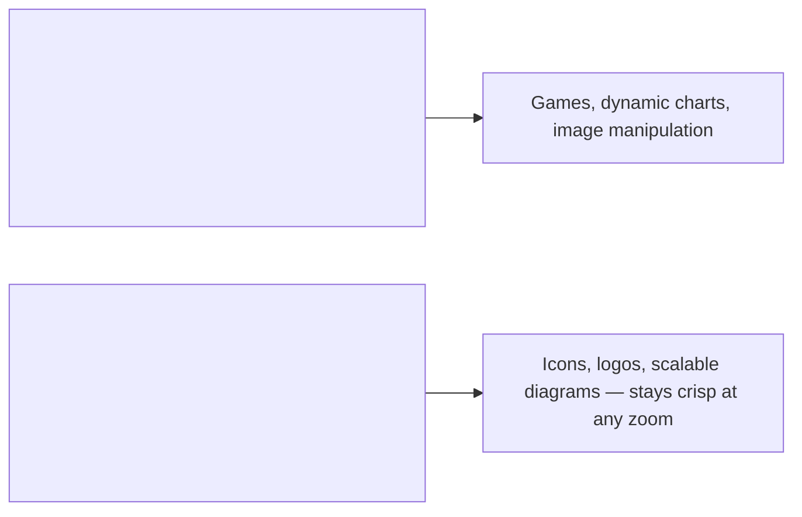

```html
<canvas id="myCanvas" width="200" height="100"></canvas>
<script>
    const ctx = document.getElementById("myCanvas").getContext("2d");
    ctx.fillRect(10, 10, 100, 50); // JS draws pixels
</script>

<svg width="100" height="100">
    <circle cx="50" cy="50" r="40" stroke="black" fill="red" />
</svg>
```

---

## 25. HTML5 APIs (Advanced — good to mention in interviews)


| API                                    | Purpose                                                                                      |
| ---------------------------------------- | ---------------------------------------------------------------------------------------------- |
| **Local Storage** (`localStorage`)     | Persistent key-value storage in the browser, survives page reloads                           |
| **Session Storage** (`sessionStorage`) | Same as above, but cleared when the tab closes                                               |
| **Geolocation API**                    | Access user's location (with permission)                                                     |
| **Drag and Drop API**                  | Native drag-and-drop interactions                                                            |
| **Web Storage vs Cookies**             | localStorage has more space (~5-10MB) and isn't sent with every HTTP request, unlike cookies |

```html
<div draggable="true" ondragstart="event.dataTransfer.setData('text', event.target.id)">Drag me</div>
```

---

## 26. Global Attributes (work on almost any HTML element)


| Attribute         | Purpose                                                                           |
| ------------------- | ----------------------------------------------------------------------------------- |
| `id`              | Unique identifier for an element                                                  |
| `class`           | Assigns one or more CSS classes                                                   |
| `style`           | Inline CSS                                                                        |
| `title`           | Tooltip text on hover                                                             |
| `data-*`          | Custom data attributes (e.g.,`data-user-id="42"`) — used heavily with JavaScript |
| `hidden`          | Hides the element                                                                 |
| `contenteditable` | Makes content directly editable by the user                                       |
| `tabindex`        | Controls keyboard-tab navigation order                                            |

---

## 27. Accessibility (a11y) Basics — increasingly important in interviews

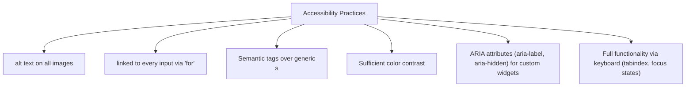

```html
<button aria-label="Close menu">✕</button>
```

---

## 28. HTML Comments and Best Practices

```html
<!-- This is a comment, not shown to users -->
```

**Best practices checklist:**

- Always include `<!DOCTYPE html>`
- Always set `lang` attribute (`<html lang="en">`) for accessibility/SEO
- One `<h1>` per page (semantic hierarchy)
- Always add `alt` text to images
- Use semantic tags instead of `<div>` for everything
- Close all tags properly (even though browsers are forgiving, don't rely on it)
- Keep structure (HTML) separate from style (CSS) and behavior (JS)

---

## 29. Complete Mental Model — Web Request to Rendered HTML

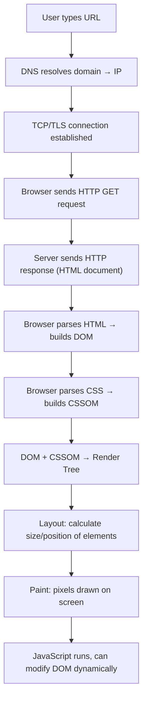

---

## Quick-Fire Interview Q&A (Flashcard style)

```python
# Cover the answer, try to recall it first, then check.

Q1 = "Is HTML a programming language?"
A1 = "No. HTML is a MARKUP language — it describes structure/content, but has no logic, variables, loops, or conditionals."

Q2 = "What's the difference between the Internet and the Web?"
A2 = "The Internet is the underlying global network of connected devices. The Web (WWW) is a service that runs ON the Internet — a system of linked documents accessed via HTTP."

Q3 = "What happens when you type a URL and press Enter?"
A3 = "DNS resolves the domain to an IP → browser opens a TCP/TLS connection → sends an HTTP request → server responds → browser parses HTML/CSS/JS and renders the page."

Q4 = "GET vs POST — when do you use which?"
A4 = "GET retrieves data, appends parameters to the URL, has no body, and is used for non-sensitive reads (like search). POST sends data in the request body, used for creating/submitting sensitive or large data (like login forms)."

Q5 = "Why prefer semantic tags like <article> and <nav> over generic <div>s?"
A5 = "Semantic tags improve accessibility (screen readers understand structure), SEO (search engines weigh meaningfully-tagged content), and code readability."

Q6 = "What's the difference between <b>/<i> and <strong>/<em>?"
A6 = "<b> and <i> are purely visual (bold/italic). <strong> and <em> carry semantic meaning (importance/emphasis) that screen readers and search engines recognize."

Q7 = "Why is the alt attribute important on ?"
A7 = "It provides fallback text if the image fails to load, and is read aloud by screen readers — essential for accessibility and also helps SEO."

Q8 = "What's the difference between localStorage and cookies?"
A8 = "localStorage stores more data (~5-10MB), persists until explicitly cleared, and is NOT sent with every HTTP request. Cookies are smaller (~4KB), can have expiry dates, and ARE sent with every request to the server — useful for sessions/auth but adds overhead."

Q9 = "What does the viewport meta tag do, and why does it matter?"
A9 = "It tells mobile browsers to render the page at the device's actual width instead of a default desktop width, which is essential for responsive design."

Q10 = "Why should target='_blank' links include rel='noopener noreferrer'?"
A10 = "Without it, the new tab can access window.opener and potentially redirect the original tab to a malicious page — a security risk called tabnabbing."
```

---

## One-Line Summary

> **"The Web is a system of linked documents delivered over HTTP between clients and servers; HTML is the markup language that structures those documents into headings, text, links, media, forms, and semantic regions that both browsers and assistive technologies can understand."**

### Final Takeaways Checklist

- ✅ Internet ≠ Web ≠ Browser — three distinct layers
- ✅ URL → DNS → TCP/TLS → HTTP Request/Response → DOM render is the full pipeline
- ✅ HTTP methods (GET/POST/PUT/PATCH/DELETE) and status code ranges (2xx/3xx/4xx/5xx) are must-knows
- ✅ HTML is markup, not programming — describes structure only
- ✅ Tag vs Element vs Attribute — know the exact terminology
- ✅ Semantic HTML5 tags (`header`, `nav`, `main`, `article`, `section`, `footer`) beat generic `<div>`s for accessibility & SEO
- ✅ Forms: know input types, validation attributes, and GET vs POST behavior
- ✅ Accessibility (`alt`, `label`, ARIA) is increasingly interview-relevant
- ✅ `<canvas>` (pixel-based) vs `<svg>` (vector-based) — advanced graphics distinction

---

*Complete Web + HTML reference notes — from absolute basics to advanced concepts, for interview prep & quick revision.*
