# CSS — Complete In-Depth Notes (Basic to Advanced)

> Structure, styling, and layout mastery — organized with diagrams for interview prep and deep understanding.

---

## 1. What is CSS?

**CSS = Cascading Style Sheets.** It controls the *presentation* of HTML — colors, spacing, layout, fonts, animations — while HTML handles structure/content.

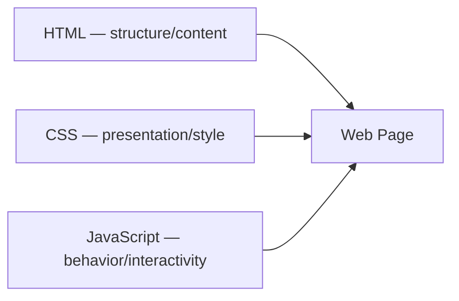

**"Cascading"** means: when multiple rules target the same element, CSS follows a defined order of priority to decide which one wins (covered in depth in Section 5).

---

## 2. Three Ways to Add CSS

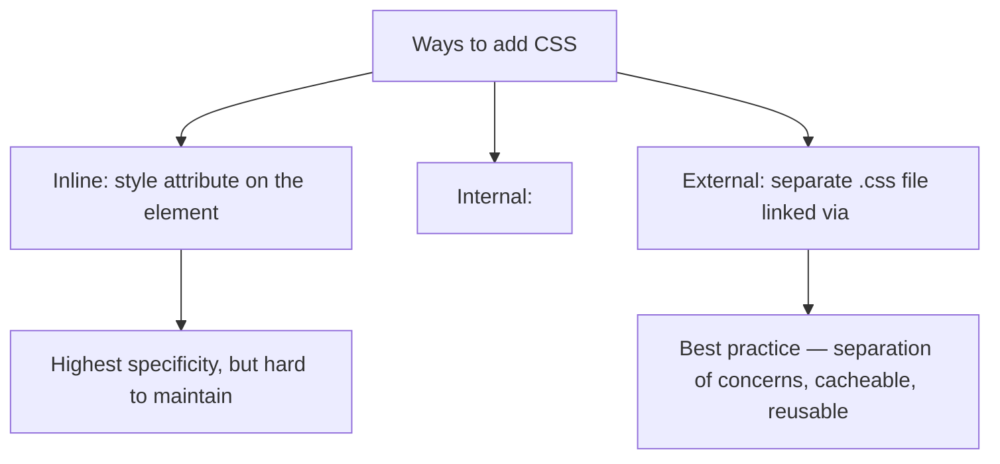

```html
<!-- Inline -->
<p style="color: red;">Text</p>

<!-- Internal -->
<style>
    p { color: red; }
</style>

<!-- External (recommended) -->
<link rel="stylesheet" href="styles.css">
```

---

## 3. CSS Syntax

```css
selector {
    property: value;
    property2: value2;
}
```

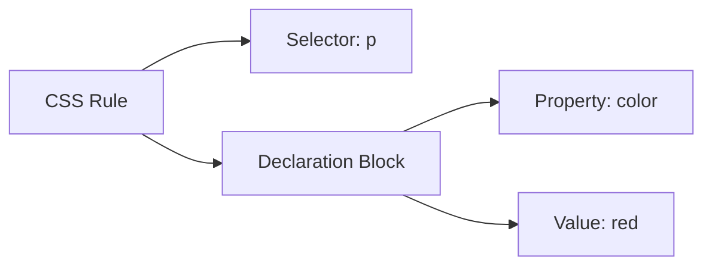

```css
p {
    color: blue;
    font-size: 16px;
}
```

---

## 4. Selectors — Full Reference (heavily interview-tested)

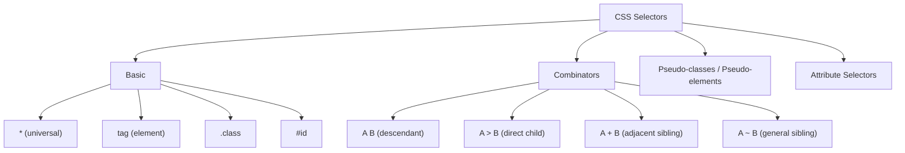

```css
* { margin: 0; }                     /* universal */
p { color: black; }                  /* element */
.btn { padding: 10px; }              /* class */
#header { background: navy; }        /* id */

div p { color: gray; }               /* descendant: any p inside div */
div > p { color: gray; }             /* direct child only */
h1 + p { margin-top: 0; }            /* immediately after h1 */
h1 ~ p { color: green; }             /* any p sibling after h1 */

a[target="_blank"] { color: orange; } /* attribute selector */
input[type="text"] { border: 1px solid gray; }
```

### Pseudo-classes (state-based)

```css
a:hover { color: red; }
a:visited { color: purple; }
input:focus { outline: 2px solid blue; }
li:first-child { font-weight: bold; }
li:last-child { border: none; }
li:nth-child(2) { background: yellow; }
li:nth-child(odd) { background: #eee; }
button:disabled { opacity: 0.5; }
```

### Pseudo-elements (target a *part* of an element)

```css
p::first-line { font-weight: bold; }
p::first-letter { font-size: 2em; }
.quote::before { content: "“"; }
.quote::after { content: "”"; }
```

> **Interview tip:** Pseudo-classes use a single colon (`:hover`), pseudo-elements use double colon (`::before`) in modern CSS — though `:before` still works for legacy compatibility.

---

## 5. The Cascade — How CSS Decides Which Rule Wins

This is **the single most important interview concept** in CSS.

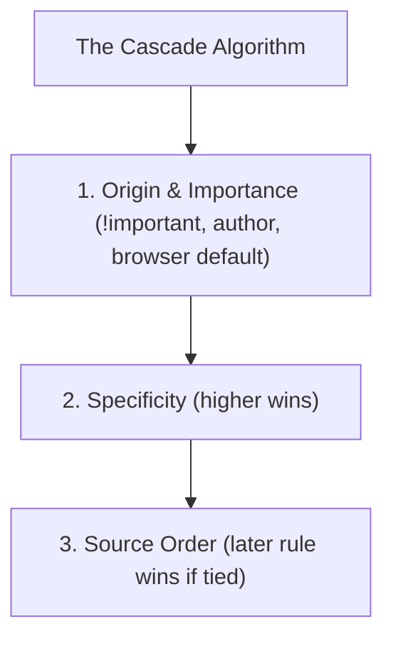

### Specificity Calculation

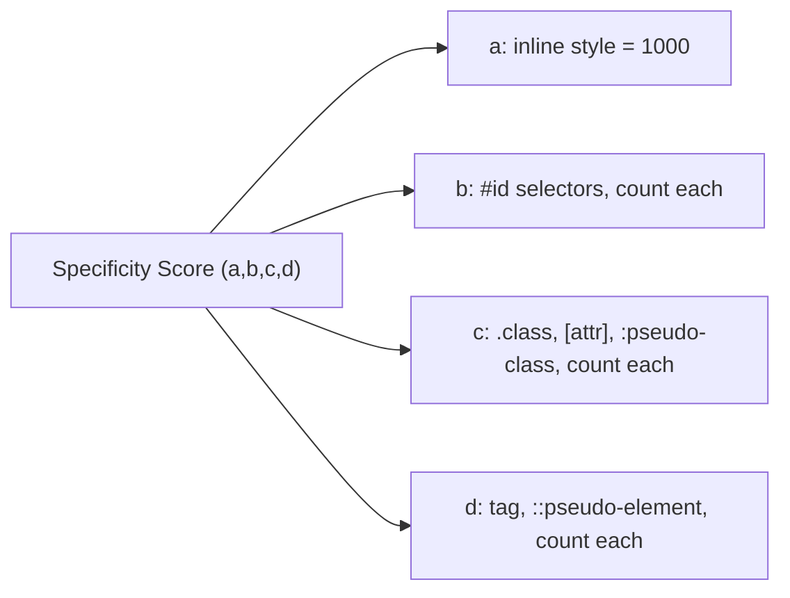


| Selector               | Specificity (roughly)                 |
| ------------------------ | --------------------------------------- |
| `*`                    | 0                                     |
| `p`                    | 1 (element)                           |
| `.class`               | 10 (class)                            |
| `#id`                  | 100 (id)                              |
| `style="..."` (inline) | 1000                                  |
| `!important`           | Overrides everything (use sparingly!) |

```css
p { color: blue; }              /* specificity: 1 */
.text { color: green; }         /* specificity: 10 — WINS over p */
#main { color: red; }           /* specificity: 100 — WINS over .text */
p { color: orange !important; } /* WINS over everything except another !important with higher specificity */
```

> **Interview line:** "!important should be avoided in production code — it breaks the natural cascade and makes debugging specificity conflicts much harder."

---

## 6. Inheritance

Some CSS properties automatically pass from parent to child; others don't.

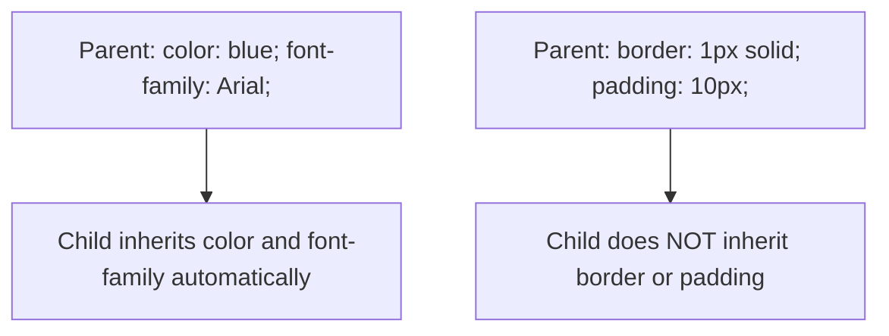

**Inherited by default:** `color`, `font-family`, `font-size`, `line-height`, `visibility`, `text-align`.

**NOT inherited by default:** `margin`, `padding`, `border`, `background`, `width`, `height`, `position`.

You can force inheritance with:

```css
.child { border: inherit; }
```

---

## 7. The Box Model (fundamental — draw this in every interview)

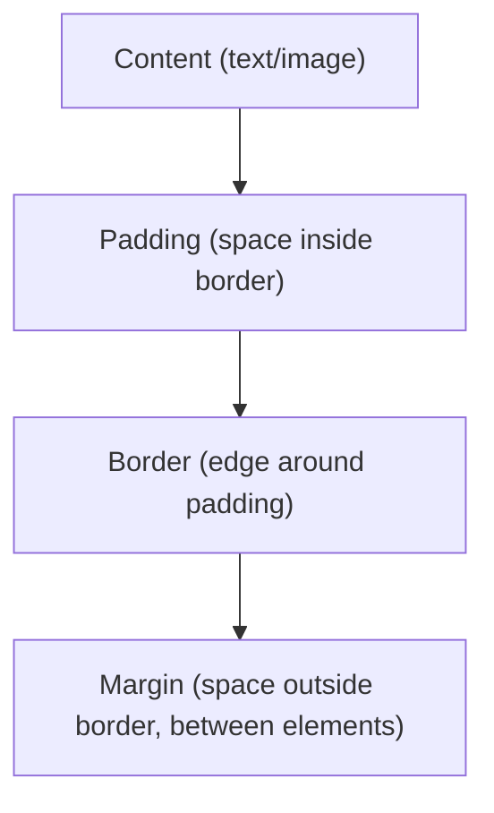

```
┌─────────────────────────────┐
│           margin             │
│  ┌─────────────────────┐    │
│  │       border          │   │
│  │  ┌───────────────┐   │   │
│  │  │    padding      │  │   │
│  │  │  ┌─────────┐   │  │   │
│  │  │  │ content │   │  │   │
│  │  │  └─────────┘   │  │   │
│  │  └───────────────┘   │   │
│  └─────────────────────┘    │
└─────────────────────────────┘
```

```css
.box {
    width: 200px;
    padding: 20px;
    border: 5px solid black;
    margin: 10px;
}
```

### `box-sizing` — a HUGE interview gotcha

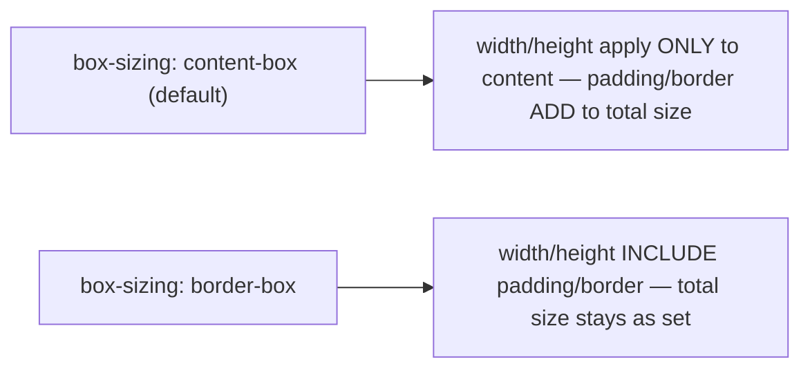

```css
* {
    box-sizing: border-box; /* almost universally recommended */
}
```

With `content-box` (default), a `.box` with `width: 200px; padding: 20px; border: 5px;` actually renders at **250px wide** total. With `border-box`, it stays exactly **200px** total — padding/border eat into the content area instead.

---

## 8. Display Property

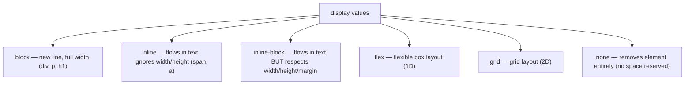

```css
.hidden { display: none; }       /* vs visibility: hidden (keeps space, just invisible) */
```

> **Interview trap:** `display: none` removes the element from layout flow entirely; `visibility: hidden` hides it but still reserves its space.

---

## 9. Positioning (very commonly asked, draw diagrams here)

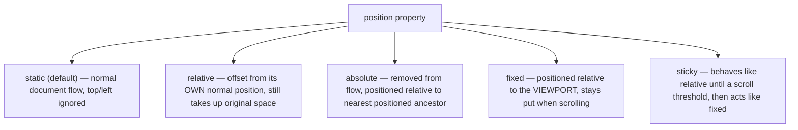

```css
.relative-box {
    position: relative;
    top: 10px;
    left: 20px;
}

.absolute-box {
    position: absolute;
    top: 0;
    right: 0;
}

.fixed-navbar {
    position: fixed;
    top: 0;
    width: 100%;
}

.sticky-header {
    position: sticky;
    top: 0;
}
```

> **Interview line on `absolute`:** "An absolutely positioned element is placed relative to the nearest ANCESTOR with `position` set to anything other than `static` — if no such ancestor exists, it's positioned relative to the initial containing block (the viewport)."

`z-index` controls stacking order — only works on positioned elements (not `static`).

---

## 10. Flexbox — One-Dimensional Layout (must-know deeply)

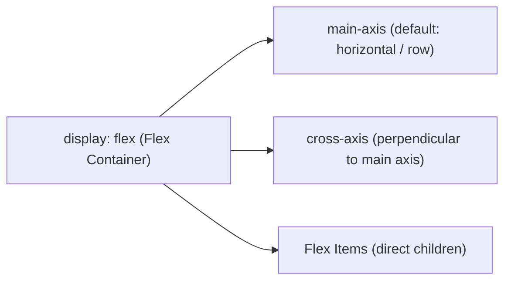

```css
.container {
    display: flex;
    flex-direction: row;        /* row | row-reverse | column | column-reverse */
    justify-content: center;    /* aligns items along MAIN axis */
    align-items: center;        /* aligns items along CROSS axis */
    flex-wrap: wrap;            /* allows items to wrap to next line */
    gap: 10px;                  /* spacing between items */
}

.item {
    flex-grow: 1;    /* how much it grows relative to siblings */
    flex-shrink: 1;  /* how much it shrinks if space is tight */
    flex-basis: 100px; /* starting size before grow/shrink applied */
    /* shorthand: */
    flex: 1 1 100px;
}
```

### `justify-content` options (main axis)

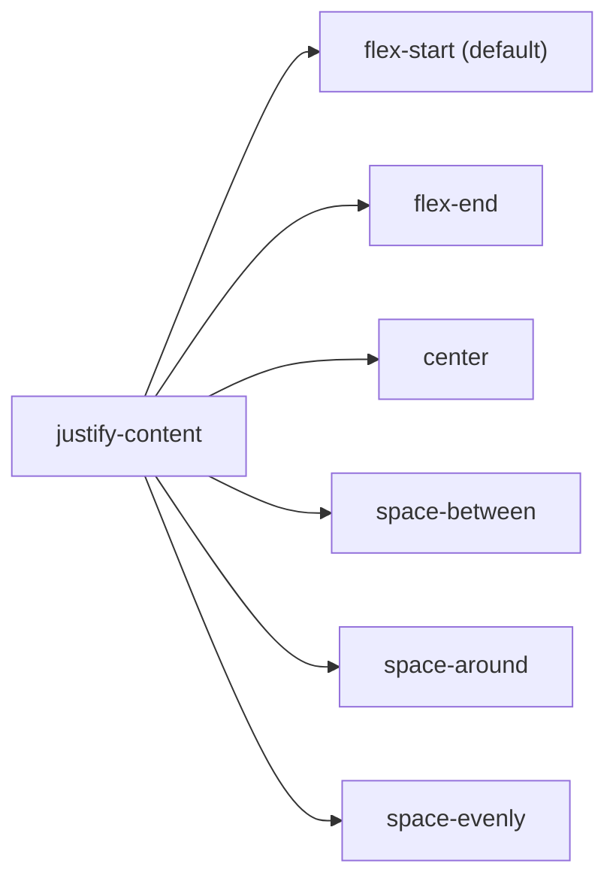

### `align-items` options (cross axis)

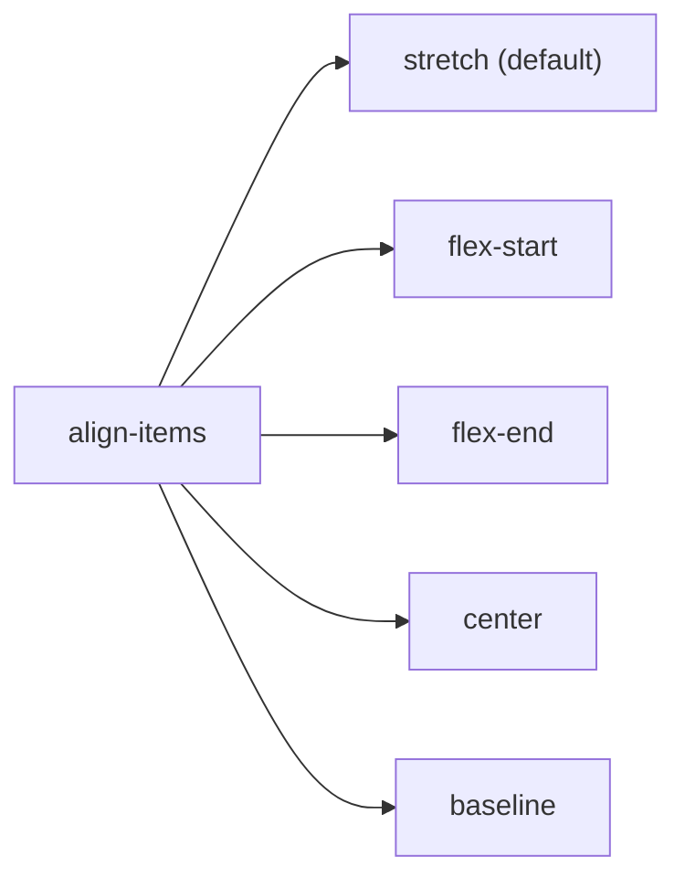

> **Classic interview task:** "Center a div both horizontally and vertically" → `display: flex; justify-content: center; align-items: center;` on the parent.

---

## 11. CSS Grid — Two-Dimensional Layout

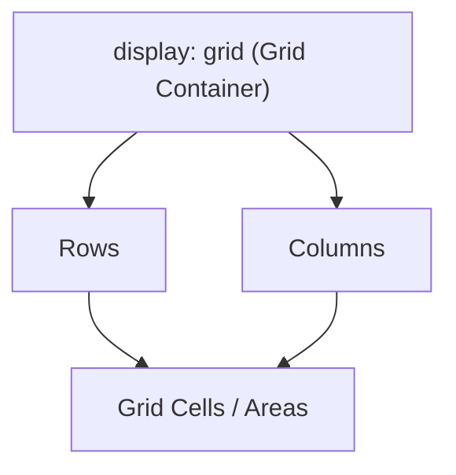

```css
.grid-container {
    display: grid;
    grid-template-columns: 1fr 2fr 1fr;   /* 3 columns, middle twice as wide */
    grid-template-rows: 100px auto;
    gap: 20px;
}

.item-a {
    grid-column: 1 / 3;   /* spans from column line 1 to 3 */
    grid-row: 1 / 2;
}
```

### Named grid areas (very readable, often asked)

```css
.container {
    display: grid;
    grid-template-areas:
        "header header header"
        "sidebar main main"
        "footer footer footer";
    grid-template-columns: 1fr 3fr 3fr;
}
.header  { grid-area: header; }
.sidebar { grid-area: sidebar; }
.main    { grid-area: main; }
.footer  { grid-area: footer; }
```

### Flexbox vs Grid (frequently asked comparison)


|             | Flexbox                                          | Grid                                        |
| ------------- | -------------------------------------------------- | --------------------------------------------- |
| Dimension   | One-dimensional (row OR column)                  | Two-dimensional (rows AND columns together) |
| Best for    | Navbars, button groups, aligning items in a line | Full page layouts, complex grids            |
| Item sizing | Content-driven, flexible                         | Explicitly defined tracks                   |

> **Interview line:** "Use Flexbox for laying items out in a single row or column; use Grid when you need to control both rows and columns simultaneously, like a full page layout."

---

## 12. Units — px, %, em, rem, vw, vh (must understand differences)

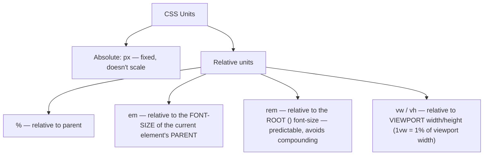

```css
html { font-size: 16px; }

.parent {
    font-size: 20px;
}
.child {
    font-size: 1.5em;   /* 1.5 × 20px = 30px (relative to PARENT) */
    font-size: 1.5rem;  /* 1.5 × 16px = 24px (relative to ROOT, ignores parent) */
}
.hero {
    width: 100vw;   /* full viewport width */
    height: 100vh;  /* full viewport height */
}
```

> **Interview trap (`em` compounding):** Nested elements using `em` can compound unexpectedly (e.g., 3 nested `1.2em` elements multiply together), which is why `rem` is generally preferred for consistent, predictable sizing.

---

## 13. Colors

```css
.a { color: red; }                       /* named color */
.b { color: #ff0000; }                   /* hex */
.c { color: rgb(255, 0, 0); }            /* rgb */
.d { color: rgba(255, 0, 0, 0.5); }      /* rgb + alpha (transparency) */
.e { color: hsl(0, 100%, 50%); }         /* hue, saturation, lightness */
.f { color: hsla(0, 100%, 50%, 0.5); }   /* hsl + alpha */
```

---

## 14. Typography

```css
p {
    font-family: 'Roboto', Arial, sans-serif; /* fallback chain */
    font-size: 16px;
    font-weight: 400;       /* 100–900, or normal/bold */
    font-style: italic;
    line-height: 1.5;       /* unitless preferred — multiplies font-size */
    letter-spacing: 0.5px;
    text-align: center;
    text-decoration: underline;
    text-transform: uppercase;
    white-space: nowrap;    /* prevents text wrapping */
    text-overflow: ellipsis; /* "..." for overflowing text (needs overflow: hidden) */
}
```

---

## 15. Backgrounds

```css
.hero {
    background-color: #333;
    background-image: url('bg.jpg');
    background-size: cover;      /* cover | contain | specific size */
    background-position: center;
    background-repeat: no-repeat;
    /* shorthand */
    background: #333 url('bg.jpg') center/cover no-repeat;
}
```

---

## 16. CSS Variables (Custom Properties) — Advanced/Modern CSS

```css
:root {
    --primary-color: #3498db;
    --spacing-unit: 8px;
}

.button {
    background-color: var(--primary-color);
    padding: calc(var(--spacing-unit) * 2);
}

.button:hover {
    background-color: var(--primary-color, blue); /* fallback if variable undefined */
}
```

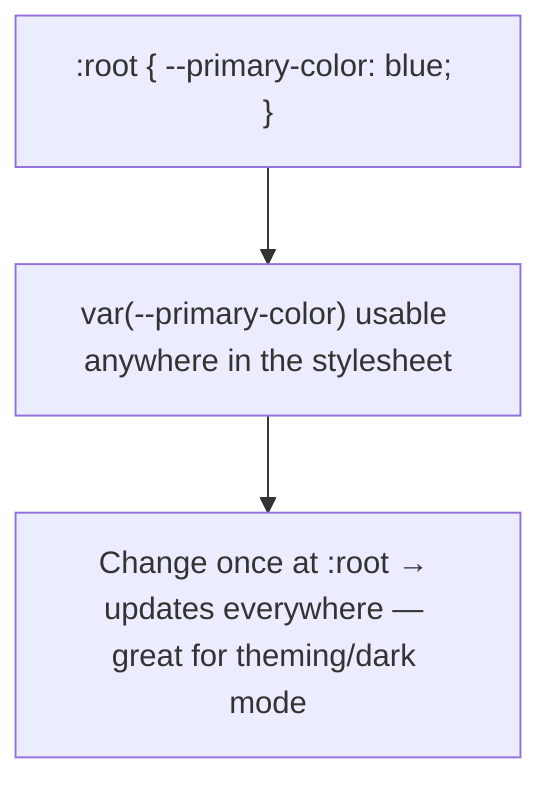

> **Interview line:** "CSS variables are dynamic and can be changed at runtime via JavaScript (`element.style.setProperty()`), unlike Sass variables which are compiled away and fixed at build time."

---

## 17. Transitions (smooth state changes)

```css
.button {
    background-color: blue;
    transition: background-color 0.3s ease-in-out;
}
.button:hover {
    background-color: darkblue;
}
```

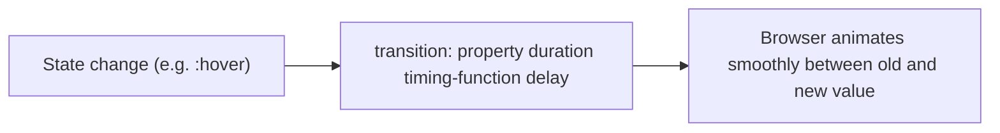

Common timing functions: `ease`, `linear`, `ease-in`, `ease-out`, `ease-in-out`, `cubic-bezier(...)`.

---

## 18. Animations (keyframe-based, more control than transitions)

```css
@keyframes slideIn {
    from { transform: translateX(-100%); opacity: 0; }
    to   { transform: translateX(0); opacity: 1; }
}

.card {
    animation: slideIn 0.5s ease-out forwards;
}
```


|         | Transition                                    | Animation                                   |
| --------- | ----------------------------------------------- | --------------------------------------------- |
| Trigger | Requires a state change (hover, class toggle) | Can run automatically on load, repeat/loop  |
| Control | Only start → end (2 states)                  | Multiple keyframe steps (0% → 50% → 100%) |

---

## 19. Transform

```css
.box {
    transform: translateX(50px);    /* move */
    transform: scale(1.5);          /* resize */
    transform: rotate(45deg);       /* rotate */
    transform: skew(10deg, 5deg);   /* skew */
    /* combine multiple */
    transform: translateX(50px) rotate(45deg) scale(1.2);
}
```

> **Performance note (great interview answer):** `transform` and `opacity` are the cheapest properties to animate because they're handled by the GPU compositor without triggering layout/reflow — unlike animating `width`, `top`, or `margin`, which force expensive layout recalculations.

---

## 20. Responsive Design & Media Queries

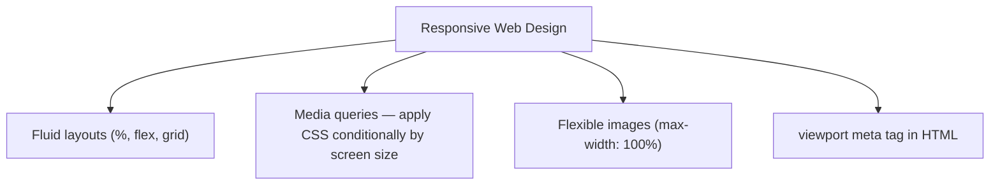

```css
/* Mobile-first approach (recommended) */
.container {
    width: 100%;
}

@media (min-width: 768px) {
    .container { width: 750px; }   /* tablet */
}

@media (min-width: 1024px) {
    .container { width: 970px; }   /* desktop */
}
```

**Mobile-first vs Desktop-first:**

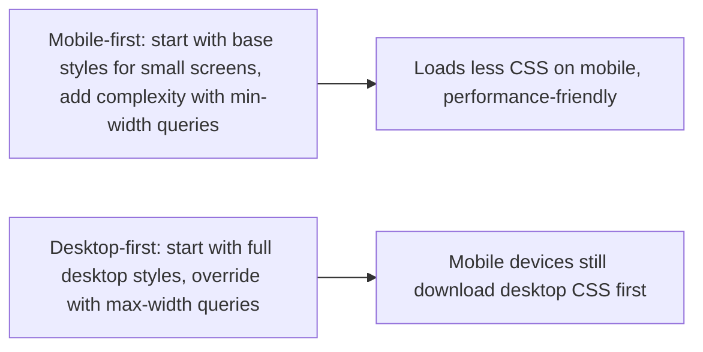

---

## 21. Overflow

```css
.box {
    overflow: visible;  /* default, content spills out */
    overflow: hidden;   /* clips overflowing content */
    overflow: scroll;   /* always shows scrollbars */
    overflow: auto;     /* scrollbars appear only when needed */
}
```

---

## 22. CSS Methodologies — BEM (interview-relevant for teams/scale)

**BEM = Block, Element, Modifier** — a naming convention to avoid specificity wars and keep CSS predictable at scale.

```css
/* Block */
.card { }

/* Element (part of the block) */
.card__title { }
.card__image { }

/* Modifier (variation) */
.card--featured { }
.card__title--large { }
```

```html
<div class="card card--featured">
    
    <h2 class="card__title card__title--large">Title</h2>
</div>
```

> **Why it matters:** BEM keeps specificity flat (mostly single class selectors), making the cascade predictable and CSS easier to maintain in large teams/codebases.

---

## 23. Preprocessors (Sass/SCSS) — Good to Mention

```scss
$primary-color: #3498db;

.card {
    color: $primary-color;
    &:hover {              // nesting, & = parent selector
        color: darken($primary-color, 10%);
    }
    .card__title {
        font-weight: bold;
    }
}
```

Sass adds variables, nesting, mixins, functions, and partials — but compiles down to plain CSS before shipping to the browser (unlike native CSS variables, which are live at runtime).

---

## 24. Z-index and Stacking Context

```mermaid
flowchart TD
    Z["z-index"] --> Rule1["Only works on positioned elements (relative/absolute/fixed/sticky)"]
    Z --> Rule2["Higher value = closer to the viewer, drawn on top"]
    Z --> Rule3["Stacking context: certain properties (opacity < 1, transform, position + z-index) CREATE a new local stacking context"]
```

```css
.modal {
    position: fixed;
    z-index: 1000;
}
```

> **Interview trap:** A child's `z-index` is only meaningful *relative to its own stacking context* — a child with `z-index: 9999` can still appear BEHIND a sibling of its parent if the parent itself has a lower stacking order.

---

## 25. Common Interview Layout Challenges (practice mentally)

```mermaid
flowchart TD
    Q1["Center a div horizontally + vertically"] --> A1["display:flex; justify-content:center; align-items:center;"]
    Q2["Sticky footer (footer stays at bottom even on short pages)"] --> A2["body{display:flex;flex-direction:column;min-height:100vh} main{flex:1}"]
    Q3["Equal-height columns"] --> A3["display:flex on the row container (items stretch by default)"]
    Q4["Responsive image that doesn't overflow"] --> A4["max-width:100%; height:auto;"]
```

---

## Quick-Fire Interview Q&A (Flashcard style)

```python
# Cover the answer, try to recall it first, then check.

Q1 = "What does 'Cascading' in CSS actually mean?"
A1 = "When multiple rules target the same element, CSS resolves conflicts using a defined priority order: importance (!important) > specificity > source order (later rule wins if tied)."

Q2 = "How is specificity calculated?"
A2 = "Roughly: inline styles (1000) > ID selectors (100 each) > class/attribute/pseudo-class selectors (10 each) > element/pseudo-element selectors (1 each). Higher total wins."

Q3 = "content-box vs border-box — what's the difference?"
A3 = "content-box (default): width/height apply only to content, padding/border ADD to the total rendered size. border-box: width/height INCLUDE padding/border, so total size stays fixed."

Q4 = "display:none vs visibility:hidden?"
A4 = "display:none removes the element from layout entirely (no space reserved). visibility:hidden hides it visually but still reserves its space in the layout."

Q5 = "position:relative vs position:absolute vs position:fixed?"
A5 = "relative: offset from its own normal position, space still reserved. absolute: removed from flow, positioned relative to the nearest positioned ancestor. fixed: positioned relative to the viewport, stays fixed during scroll."

Q6 = "When would you use Flexbox vs Grid?"
A6 = "Flexbox for one-dimensional layouts (a single row or column, like a navbar). Grid for two-dimensional layouts (rows AND columns together, like a full page structure)."

Q7 = "em vs rem — what's the key difference?"
A7 = "em is relative to the parent element's font-size and can compound when nested. rem is always relative to the root (html) font-size, making it more predictable."

Q8 = "Why are transform and opacity considered 'cheap' to animate?"
A8 = "They're handled directly by the GPU compositor without triggering layout/reflow recalculations, unlike animating width, top, or margin which force expensive reflows."

Q9 = "What is BEM and why use it?"
A9 = "Block-Element-Modifier — a CSS naming convention (.block__element--modifier) that keeps specificity flat and predictable, avoiding specificity wars in large codebases."

Q10 = "Why doesn't z-index work on a static element?"
A10 = "z-index only applies to positioned elements (position: relative/absolute/fixed/sticky) — on a static element, the browser ignores it entirely."
```

---

## One-Line Summary

> **"CSS controls presentation through a cascade of rules resolved by importance → specificity → source order; mastering the box model, positioning, Flexbox/Grid, and units is what separates knowing CSS syntax from actually being able to build real layouts."**

### Final Takeaways Checklist

- ✅ Cascade order: importance → specificity → source order
- ✅ Specificity: inline > id > class/attribute/pseudo-class > element
- ✅ Box model: content → padding → border → margin; `box-sizing: border-box` is the sane default
- ✅ `position`: static/relative/absolute/fixed/sticky each behave very differently
- ✅ Flexbox = 1D layout, Grid = 2D layout — know when to reach for each
- ✅ `rem` > `em` for predictable sizing (no compounding)
- ✅ `transform`/`opacity` are GPU-cheap to animate; `width`/`top`/`margin` are not
- ✅ CSS variables (`--var`) are runtime-dynamic; Sass variables are compile-time only
- ✅ BEM keeps specificity flat and CSS maintainable at scale
- ✅ `z-index` only works on positioned elements, and is scoped to its stacking context

---

*Complete CSS reference notes — from absolute basics to advanced layout/animation concepts, for interview prep & quick revision.*
