# JavaScript — The Complete In-Depth Guide

*Fundamentals → Advanced · Explanations · Code · Diagrams*

---

## Table of Contents

1. [JavaScript Fundamentals](#1-javascript-fundamentals)
2. [Variables & Data Types](#2-variables--data-types)
3. [Operators & Conditionals](#3-operators--conditionals)
4. [Loops](#4-loops)
5. [Functions](#5-functions)
6. [Arrays & Array Methods](#6-arrays--array-methods)
7. [Objects](#7-objects)
8. [Scope, Hoisting & TDZ](#8-scope-hoisting--tdz)
9. [Closures](#9-closures)
10. [`this`, call, apply, bind](#10-this-call-apply-bind)
11. [Prototypes & Classes](#11-prototypes--classes)
12. [Modern ES6+ Syntax](#12-modern-es6-syntax)
13. [DOM Manipulation](#13-dom-manipulation)
14. [Browser Events](#14-browser-events)
15. [Forms](#15-forms)
16. [Fetch API / REST](#16-fetch-api--rest-apis)
17. [JSON](#17-json)
18. [Storage & Cookies](#18-storage--cookies)
19. [Promises](#19-promises)
20. [Async / Await](#20-async--await)
21. [The Event Loop](#21-the-event-loop)
22. [Error Handling](#22-error-handling)
23. [ES Modules](#23-es-modules)
24. [CORS](#24-cors-basics)
25. [Browser APIs](#25-browser-apis)
26. [Debugging / DevTools](#26-debugging--devtools)
27. [Debounce & Throttle](#27-debounce--throttle)
28. [Memory & Garbage Collection](#28-memory--garbage-collection)
29. [Advanced JavaScript](#29-advanced-javascript)
30. [Cheat Sheet](#30-quick-reference-cheat-sheet)

---

## 1. JavaScript Fundamentals

JavaScript is a **single-threaded, dynamically-typed, prototype-based, multi-paradigm** language (supports procedural, object-oriented, and functional styles). It was originally *interpreted* for fast startup; modern engines like V8 (Chrome/Node), SpiderMonkey (Firefox), and JavaScriptCore (Safari) now use a **JIT (Just-In-Time) compiler** that mixes interpretation with compiled machine code for speed.

### How source code becomes execution

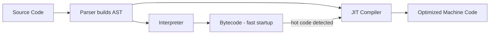

- **Parser**: reads your `.js` text and converts it into an **AST (Abstract Syntax Tree)** — a tree representation of the code's structure.
- **Interpreter**: quickly turns the AST into bytecode so the script starts running immediately (no long compile wait).
- **JIT Compiler**: watches which functions run repeatedly ("hot" code) and recompiles them into highly optimized machine code on the fly.

This hybrid approach is why modern JS is both fast to start *and* fast to run.

### Single-threaded, but not blocking (usually)

JS executes on **one Call Stack** — one thing at a time. Long-running I/O (network requests, timers, file reads in Node) is delegated to the environment (browser Web APIs / Node's libuv) so the main thread isn't frozen. This coordination is handled by the **Event Loop** (§21).

```js
console.log(typeof 42);            // "number"
console.log(typeof "hi");          // "string"
console.log(typeof {});            // "object"
console.log(typeof function(){});  // "function"
console.log(typeof undefined);     // "undefined"
console.log(typeof Symbol());      // "symbol"
```


| Environment | Global Object | Extra APIs                            |
| ------------- | --------------- | --------------------------------------- |
| Browser     | `window`      | DOM,`fetch`, `localStorage`, events   |
| Node.js     | `global`      | `fs`, `process`, CommonJS/ESM modules |

> **Note:** Both browser and Node share the *core* JS language (ECMAScript spec). The differences are only in the **host environment APIs** layered on top.

---

## 2. Variables & Data Types

```js
var a = 1;    // function-scoped, hoisted (initialized to undefined), re-declarable
let b = 2;    // block-scoped, reassignable, NOT re-declarable in same scope
const c = 3;  // block-scoped, the BINDING cannot be reassigned (object contents still mutable)
```

> `const` does not mean "immutable value" — it means "this variable name can't be reassigned to point elsewhere." `const arr = [1]; arr.push(2)` is perfectly legal.

### Primitives vs. Reference Types — Stack vs. Heap

Primitives are stored **by value** on the stack (copied whenever assigned). Objects are stored **by reference** — the variable on the stack just holds a pointer to the object's actual data on the heap.

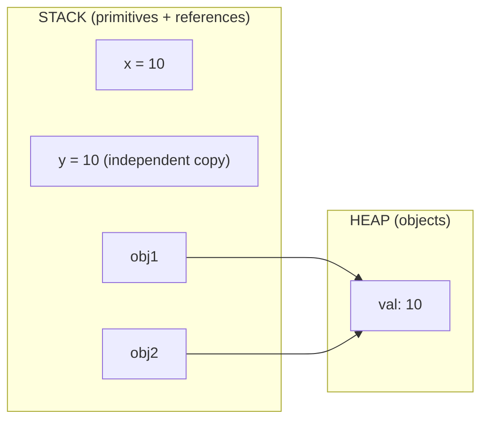

```js
let x = 10, y = x;
y = 20;
console.log(x); // 10 — primitives are copied, unaffected

let obj1 = { val: 10 };
let obj2 = obj1;         // obj2 points to the SAME object as obj1
obj2.val = 20;
console.log(obj1.val);   // 20 — shared reference! Both variables see the change
```

This is the single most common source of "mystery bugs" for beginners: mutating an object through one variable silently changes what every other variable pointing at it sees.

### The 8 data types


| Type        | Category  | Example                                          |
| ------------- | ----------- | -------------------------------------------------- |
| `string`    | Primitive | `"hello"`                                        |
| `number`    | Primitive | `42`, `3.14`, `NaN`, `Infinity`                  |
| `bigint`    | Primitive | `123n`                                           |
| `boolean`   | Primitive | `true` / `false`                                 |
| `undefined` | Primitive | `let x;` (declared, no value assigned)           |
| `null`      | Primitive | `let y = null;` (intentional "no value")         |
| `symbol`    | Primitive | `Symbol('id')` — guaranteed-unique key          |
| `object`    | Reference | `{}`, `[]`, `function(){}`, `Date`, `Map`, `Set` |

> **Gotcha:** `typeof null === "object"` — this is a decades-old bug baked into the spec for backward compatibility. Use `value === null` to check for null, and `Array.isArray(value)` to check for arrays (since `typeof [] === "object"` too).

---

## 3. Operators & Conditionals

```js
// Arithmetic
5 + 2   // 7
5 - 2   // 3
5 * 2   // 10
5 / 2   // 2.5
5 % 2   // 1  (remainder)
5 ** 2  // 25 (exponent)

// Comparison
5 == "5"   // true  — loose equality COERCES types before comparing
5 === "5"  // false — strict equality checks type AND value ✅ always prefer this

// Logical
true && false   // false
true || false   // true
!true           // false

// Nullish coalescing & optional chaining (ES2020)
let val = null ?? "default";        // "default" — only falls back on null/undefined
let name = user?.profile?.name;     // safely reads deep, returns undefined if any link is missing
```

**Why `??` instead of `||`?** `||` falls back on *any* falsy value (`0`, `""`, `false`), which is often wrong. `??` only falls back on `null`/`undefined`.

```js
let count = 0;
count || 10   // 10  ❌ (0 is falsy, but 0 is a valid value here!)
count ?? 10   // 0   ✅ (0 is neither null nor undefined)
```

### Conditionals

```js
if (score >= 90) grade = "A";
else if (score >= 75) grade = "B";
else grade = "C";

const status = age >= 18 ? "adult" : "minor";   // ternary

switch (day) {
  case "Mon":
  case "Tue":
    console.log("Early week"); break;
  default:
    console.log("Other day");
}
```

> **Falsy values (memorize all 8):** `false`, `0`, `-0`, `0n`, `""`, `null`, `undefined`, `NaN`. Everything else — including `"0"`, `[]`, and `{}` — is **truthy**.

---

## 4. Loops

```js
for (let i = 0; i < 5; i++) console.log(i);

for (const val of [10, 20, 30]) console.log(val);   // iterates VALUES
for (const key in { a: 1, b: 2 }) console.log(key); // iterates KEYS (incl. inherited enumerable props!)

[1, 2, 3].forEach(n => console.log(n));

let i = 0;
while (i < 3) { console.log(i); i++; }

let j = 0;
do { console.log(j); j++; } while (j < 3);  // runs body at least once
```

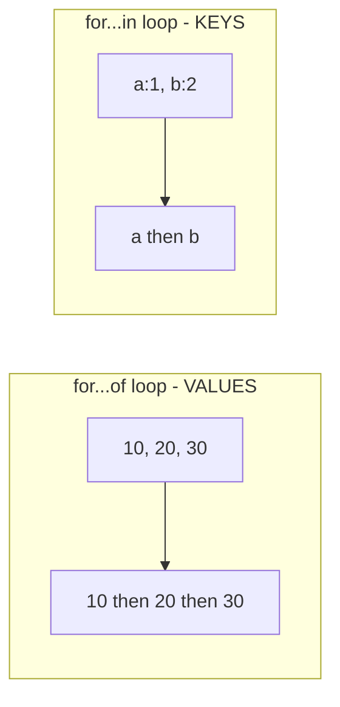

- `for...of` works on **iterables** (arrays, strings, Maps, Sets) and gives you **values**.
- `for...in` works on **any object** and gives you **enumerable keys** — including inherited ones, which is why it's discouraged for arrays.
- `continue` skips to the next iteration; `break` exits the loop entirely.

---

## 5. Functions

```js
function greet(name) { return `Hello, ${name}`; }        // declaration — fully hoisted
const greet2 = function(name) { return `Hi, ${name}`; }; // expression — not hoisted
const greet3 = name => `Hey, ${name}`;                    // arrow — no own `this`

function sum(...nums) { return nums.reduce((a, b) => a + b, 0); }
sum(1, 2, 3); // 6 — rest parameters gather remaining args into a real array

function greetWithDefault(name = "Guest") { return `Hi, ${name}`; } // default parameter
```


| Feature               | Declaration                         | Expression                       | Arrow                                   |
| ----------------------- | ------------------------------------- | ---------------------------------- | ----------------------------------------- |
| Hoisted               | ✅ fully (usable before definition) | ❌                               | ❌                                      |
| Has own`this`         | ✅                                  | ✅                               | ❌ (inherits from enclosing scope)      |
| Has`arguments` object | ✅                                  | ✅                               | ❌                                      |
| Usable with`new`      | ✅                                  | ✅                               | ❌                                      |
| Good for              | Named, reusable utilities           | Callbacks assigned to a variable | Short callbacks, preserving outer`this` |

### IIFE (Immediately Invoked Function Expression)

```js
(function () {
  console.log("Runs immediately, creates a private scope");
})();
```

---

## 6. Arrays & Array Methods

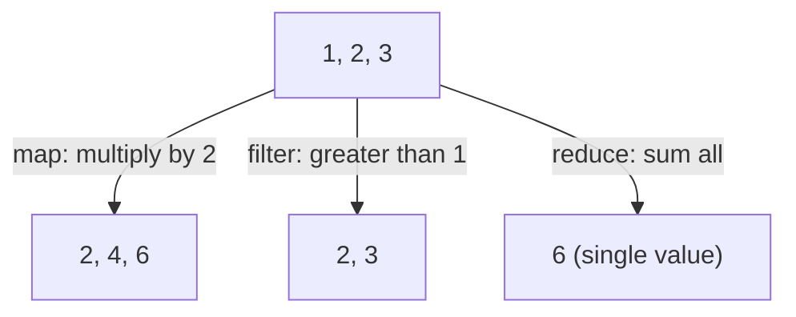

- **`map`** transforms every element → returns a **new array of the same length**.
- **`filter`** keeps elements that pass a test → returns a **new (possibly shorter) array**.
- **`reduce`** folds the whole array down into a **single accumulated value**.

```js
const arr = [5, 3, 8, 1];

// Mutating methods (change the original array)
arr.push(10);            // add to end
arr.pop();                // remove from end
arr.unshift(0);           // add to start
arr.shift();               // remove from start
arr.splice(1, 2);         // remove/insert at index
arr.sort((a, b) => a - b); // ⚠️ default sort() is lexicographic — always pass a comparator for numbers
arr.reverse();

// Non-mutating methods (return something new, original untouched)
arr.map(n => n * 2);
arr.filter(n => n > 3);
arr.reduce((acc, n) => acc + n, 0);
arr.find(n => n > 3);      // first matching element
arr.findIndex(n => n > 3); // its index
arr.includes(3);           // boolean
arr.slice(1, 3);            // shallow copy of a range
arr.flat();                  // flattens one level of nested arrays
arr.every(n => n > 0);      // true if ALL pass
arr.some(n => n > 5);       // true if ANY passes
```

> **`slice` vs `splice`:** `slice(start, end)` is non-destructive and returns a new array. `splice(start, deleteCount, ...items)` mutates the original array in place.

---

## 7. Objects

```js
const person = {
  name: "Alice",
  age: 25,
  greet() { return `Hi ${this.name}`; }
};

Object.keys(person);              // ["name","age","greet"]
Object.values(person);            // ["Alice", 25, fn]
Object.entries(person);           // [["name","Alice"], ["age",25], ...]
Object.assign({}, person, { age: 30 }); // shallow-merged new object
Object.freeze(person);            // prevents adding/removing/changing properties

const { name, age: yrs = 18 } = person;   // destructuring (renaming + default)
const updated = { ...person, age: 27 };   // spread — shallow copy + override
```

### The shallow-copy trap

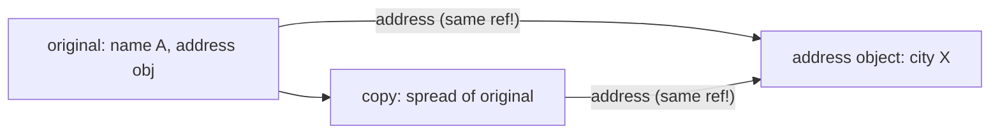

```js
const original = { name: "A", address: { city: "X" } };
const copy = { ...original };
copy.address.city = "Y";
console.log(original.address.city); // "Y" — nested object was shared, not copied!

const deepCopy = structuredClone(original); // ✅ true deep clone (modern browsers/Node 17+)
```

---

## 8. Scope, Hoisting & TDZ

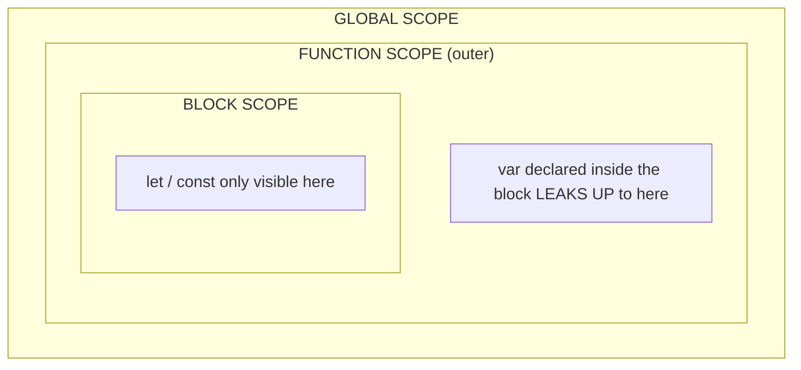

```js
console.log(a); // undefined — `var` is hoisted AND initialized to undefined
var a = 5;

console.log(b); // ❌ ReferenceError — `let` is hoisted but NOT initialized (Temporal Dead Zone)
let b = 5;
```

### Temporal Dead Zone (TDZ)

`let`/`const`/`class` declarations are hoisted to the top of their block, but stay in an uninitialized "dead zone" until the actual declaration line runs.

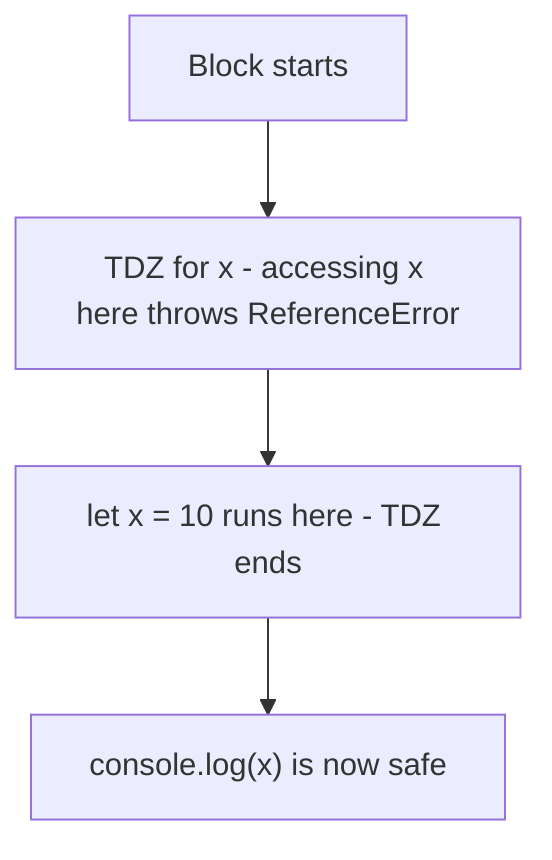


|                               | `var`                          | `let` / `const`      |
| ------------------------------- | -------------------------------- | ---------------------- |
| Scope                         | Function                       | Block                |
| Hoisted                       | Yes, initialized to`undefined` | Yes, but left in TDZ |
| Re-declarable                 | Yes                            | No (`SyntaxError`)   |
| Attached to`window`/`global`? | Yes                            | No                   |

---

## 9. Closures

A **closure** is a function bundled together with references to its surrounding ("lexical") state — it "remembers" the variables of its outer function even after that outer function has finished executing.

```js
function makeCounter() {
  let count = 0;
  return function () { return ++count; };
}
const counter = makeCounter();
counter(); // 1
counter(); // 2 — count persists between calls!
```

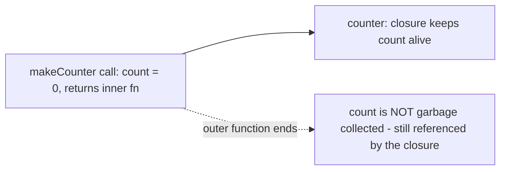

Closures are the mechanism behind private variables, memoization, and the module pattern.

### Classic pitfall: `var` vs `let` in loops

```js
for (var i = 0; i < 3; i++) setTimeout(() => console.log(i), 100); // 3, 3, 3
for (let j = 0; j < 3; j++) setTimeout(() => console.log(j), 100); // 0, 1, 2
```

**Why:** `var` is function-scoped, so all three callbacks close over the *same* `i`, which has finished looping (value 3) by the time the timers fire. `let` creates a **new binding for every iteration**, so each callback closes over its own `j`.

---

## 10. `this`, call, apply, bind

`this` is **not** determined by where a function is *defined* — it's determined by **how it's called**. Four rules, in priority order:

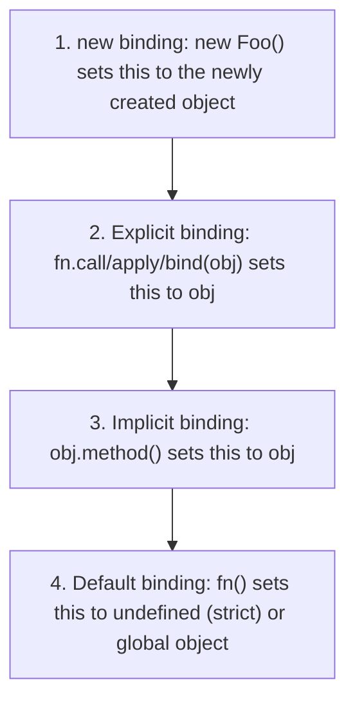

```js
function introduce(greeting) {
  console.log(`${greeting}, I'm ${this.name}`);
}
const user = { name: "Alice" };

introduce.call(user, "Hi");       // args passed individually
introduce.apply(user, ["Hi"]);    // args passed as an array
const bound = introduce.bind(user);
bound("Hey");                      // permanently bound — returns a NEW function, doesn't call it yet
```


| Method  | Invokes immediately?               | Argument style  |
| --------- | ------------------------------------ | ----------------- |
| `call`  | Yes                                | comma-separated |
| `apply` | Yes                                | array           |
| `bind`  | No — returns a new bound function | comma-separated |

> Arrow functions have **no own `this`** — they lexically inherit `this` from wherever they're defined, which is why they're popular for callbacks inside methods (they naturally preserve the outer `this`).

---

## 11. Prototypes & Classes

Every JS object has an internal link, `[[Prototype]]`, to another object it can delegate property lookups to — forming a **prototype chain**.

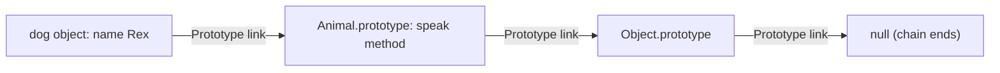

```js
// Prototype-based (pre-ES6 style)
function Animal(name) { this.name = name; }
Animal.prototype.speak = function () {
  console.log(`${this.name} makes a sound`);
};

// Class syntax — syntactic sugar over the same prototype mechanism
class Animal {
  constructor(name) { this.name = name; }
  speak() { console.log(`${this.name} makes a sound`); }
}
class Dog extends Animal {
  speak() {
    super.speak();
    console.log(`${this.name} barks`);
  }
}
new Dog("Rex").speak();
// "Rex makes a sound"
// "Rex barks"
```

> `class` is **not** hoisted the same way function declarations are — classes live in the TDZ until their definition line runs. Classes also support private fields (`#count`), static methods (`static create()`), and getters/setters.

---

## 12. Modern ES6+ Syntax

```js
const name = "Sam";
console.log(`Hello, ${name}!`);              // template literals — multi-line + interpolation

const [first, ...rest] = [1, 2, 3, 4];       // array destructuring
const { a, b: renamed, ...others } = { a: 1, b: 2, c: 3 }; // object destructuring

user?.address?.city ?? "Unknown";            // optional chaining + nullish coalescing combined

let val = null;
val ??= "default";                           // nullish assignment (only assigns if val is null/undefined)

const map = new Map([["a", 1]]);             // key-value store, ANY type can be a key
const set = new Set([1, 2, 2, 3]);           // {1, 2, 3} — automatically de-duplicates

const billion = 1_000_000_000;               // numeric separators for readability
```

---

## 13. DOM Manipulation

The **DOM (Document Object Model)** represents the HTML page as a tree of node objects that JS can read and mutate.

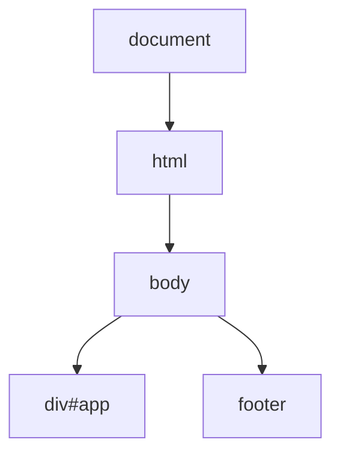

```js
document.getElementById("app");
document.querySelector(".btn");        // first match
document.querySelectorAll("li");       // NodeList of all matches

const el = document.createElement("div");
el.textContent = "Hello";
el.classList.add("box");
document.body.appendChild(el);

el.innerHTML = "<b>Bold</b>";   // parses as HTML — ⚠️ XSS risk with untrusted input
el.textContent = "Plain";        // sets as plain text, no parsing — safe
```

> Always prefer `textContent` over `innerHTML` when inserting user-supplied strings, to avoid script-injection vulnerabilities.

---

## 14. Browser Events

Events travel through the DOM tree in **two phases**: first down (**capturing**) to the target element, then back up (**bubbling**) by default.

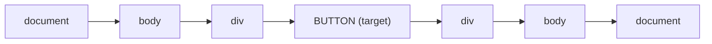

*Capturing phase (down, left→right) reaches the target, then Bubbling phase (up, left→right reversed) carries it back out — bubbling is what listeners use by default.*

```js
button.addEventListener("click", e => console.log(e.target));
child.addEventListener("click", e => e.stopPropagation());   // stop it from bubbling further
form.addEventListener("submit", e => e.preventDefault());     // stop the browser's default action

// Event delegation — ONE listener on a parent, check e.target instead of
// attaching a listener to every child (efficient for dynamic lists)
list.addEventListener("click", e => {
  if (e.target.matches("li")) console.log(e.target.textContent);
});
```

To listen during the **capturing** phase instead of bubbling, pass `{ capture: true }` as the third argument to `addEventListener`.

---

## 15. Forms

```js
const form = document.getElementById("myForm");
form.addEventListener("submit", (e) => {
  e.preventDefault();                       // stop full-page reload
  const data = new FormData(form);
  const obj = Object.fromEntries(data.entries());
  console.log(obj);
});

if (!form.checkValidity()) form.reportValidity(); // triggers built-in HTML5 validation UI
```

---

## 16. Fetch API / REST APIs

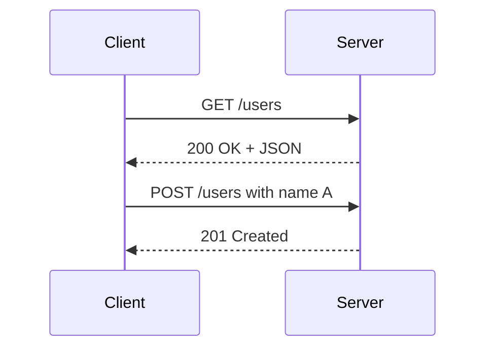

```js
async function getUsers() {
  try {
    const res = await fetch("https://api.example.com/users");
    if (!res.ok) throw new Error(`HTTP ${res.status}`);
    return await res.json();
  } catch (err) {
    console.error("Fetch failed:", err);
  }
}

fetch(url, {
  method: "POST",
  headers: { "Content-Type": "application/json" },
  body: JSON.stringify(data)
});
```

> `fetch` only rejects on **network failure** — a 404 or 500 response still resolves successfully, which is why checking `res.ok` is essential.


| Verb            | Purpose                 |
| ----------------- | ------------------------- |
| `GET`           | Read                    |
| `POST`          | Create                  |
| `PUT` / `PATCH` | Update (full / partial) |
| `DELETE`        | Remove                  |

---

## 17. JSON

```js
const obj = { name: "Alice", age: 25 };
const jsonStr = JSON.stringify(obj);      // '{"name":"Alice","age":25}'
const parsed = JSON.parse(jsonStr);
JSON.stringify(obj, null, 2);             // pretty-printed with 2-space indent
```

> `JSON.stringify` silently drops `undefined`, functions, and `Symbol` values; converts `Date` objects to ISO strings; and **throws** on circular references.

---

## 18. Storage & Cookies


| Storage          | Capacity | Persists                 | Sent to server automatically?       |
| ------------------ | ---------- | -------------------------- | ------------------------------------- |
| Cookies          | ~4KB     | Configurable (`max-age`) | ✅ Yes, with every matching request |
| `localStorage`   | ~5–10MB | Forever (until cleared)  | ❌ No                               |
| `sessionStorage` | ~5–10MB | Current tab's lifetime   | ❌ No                               |

```js
localStorage.setItem("theme", "dark");
localStorage.getItem("theme");
document.cookie = "username=Alice; max-age=3600; path=/";
```

---

## 19. Promises

A **Promise** represents the eventual result of an asynchronous operation. It always exists in exactly one of three states.

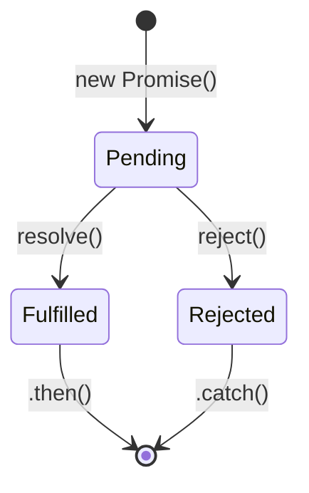

Once a promise settles (fulfilled or rejected), its state is **permanent** — it can never change again.

```js
function fetchData() {
  return new Promise((resolve, reject) => {
    setTimeout(() => success ? resolve("Data!") : reject("Error!"), 1000);
  });
}
fetchData()
  .then(d => console.log(d))
  .catch(e => console.error(e))
  .finally(() => console.log("Done"));

Promise.all([p1, p2, p3]);        // resolves when ALL succeed; rejects immediately on first failure
Promise.allSettled([p1, p2, p3]); // waits for all to settle, never rejects — gives status of each
Promise.race([p1, p2]);           // settles as soon as the FIRST promise settles (win or lose)
Promise.any([p1, p2]);            // settles as soon as the first one SUCCEEDS
```

---

## 20. Async / Await

`async`/`await` is syntactic sugar over Promises — it lets asynchronous code read like synchronous code.

```js
async function getData() {
  try {
    const res = await fetch("/api/data");
    return await res.json();
  } catch (err) {
    console.error(err);
  }
}
```

### Sequential vs. Parallel execution

```mermaid
gantt
    dateFormat X
    axisFormat %s
    section Sequential - slower
    taskA :a1, 0, 3
    taskB :a2, after a1, 3
    section Parallel - faster
    taskA :b1, 0, 3
    taskB :b2, 0, 3
```

```js
// Sequential — taskB waits for taskA to finish even though they're independent
const a = await taskA();
const b = await taskB();

// Parallel — both start immediately, total time ≈ the slower of the two
const [a2, b2] = await Promise.all([taskA(), taskB()]);
```

---

## 21. The Event Loop

This is what lets single-threaded JS handle asynchronous work without blocking.

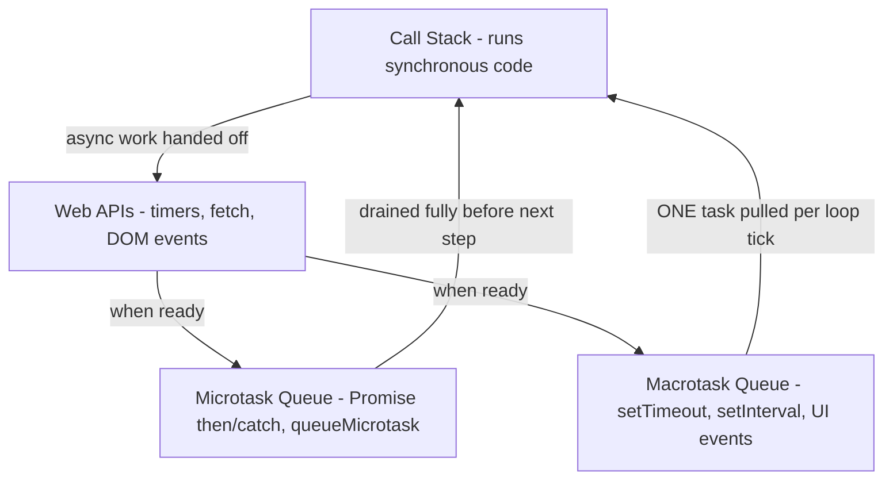

**The golden rule:** on every tick of the event loop — run everything currently on the Call Stack, then drain the **entire** Microtask Queue (even new microtasks added during draining), and only *then* pull a **single** task from the Macrotask Queue. Repeat.

```js
console.log("1: sync");
setTimeout(() => console.log("2: macrotask"), 0);
Promise.resolve().then(() => console.log("3: microtask"));
console.log("4: sync");
// Output: 1, 4, 3, 2
```

Microtasks (Promises) always jump the queue ahead of macrotasks (`setTimeout`), even with a `0ms` delay.

---

## 22. Error Handling

```js
try {
  JSON.parse("invalid");
} catch (err) {
  console.error(err.message);
} finally {
  console.log("Always runs — cleanup code goes here");
}

class ValidationError extends Error {
  constructor(msg) {
    super(msg);
    this.name = "ValidationError";
  }
}
throw new ValidationError("Age cannot be negative");

// Catch promise rejections that were never handled anywhere
window.addEventListener("unhandledrejection", e => console.error(e.reason));
```

---

## 23. ES Modules

```js
// math.js
export function add(a, b) { return a + b; }
export default function multiply(a, b) { return a * b; }

// main.js
import multiply, { add } from "./math.js";
const mod = await import("./heavy-module.js"); // dynamic import — lazy-loaded, returns a Promise
```


|                               | Regular Script | Module                               |
| ------------------------------- | ---------------- | -------------------------------------- |
| Scope                         | Global         | File-scoped (own top-level bindings) |
| Strict mode                   | Optional       | Always on                            |
| Top-level`this`               | `window`       | `undefined`                          |
| Re-execution on repeat import | Yes            | No — modules are cached, run once   |

---

## 24. CORS Basics

**CORS (Cross-Origin Resource Sharing)** is a browser security mechanism that restricts JS from one origin reading responses from a different origin, unless the server explicitly allows it.

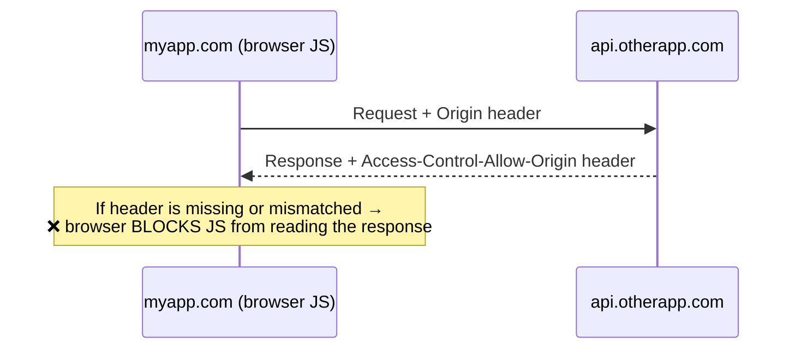

> CORS is enforced **entirely by the browser**, and the fix always lives on the **server** (adding the correct response headers) — there is no client-side JS workaround.

---

## 25. Browser APIs

```js
setTimeout(() => {}, 1000);
setInterval(() => {}, 1000);

navigator.geolocation.getCurrentPosition(pos => console.log(pos.coords));
navigator.clipboard.writeText("copied!");

const observer = new IntersectionObserver(entries => {
  entries.forEach(e => { if (e.isIntersecting) loadContent(); });
});

history.pushState({}, "", "/new-path");  // SPA client-side routing, no reload
const worker = new Worker("worker.js");   // runs JS off the main thread
```

---

## 26. Debugging / DevTools

```js
console.table([{ a: 1 }, { a: 2 }]);
console.group("Group"); console.log("nested"); console.groupEnd();
console.time("x"); /* code */ console.timeEnd("x");
debugger; // pauses execution here if DevTools is open
```


| Panel       | Use                                |
| ------------- | ------------------------------------ |
| Elements    | Inspect/edit the live DOM & CSS    |
| Sources     | Set breakpoints, step through code |
| Network     | Inspect requests, timing, payloads |
| Application | Storage, cookies, service workers  |
| Performance | CPU/memory profiling               |

---

## 27. Debounce & Throttle

Both limit how often a function runs in response to rapid, repeated events — but with different strategies.

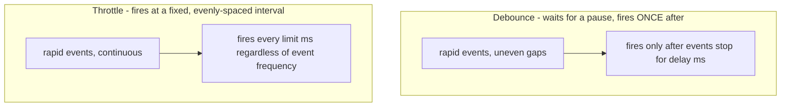

```js
function debounce(fn, delay) {
  let timer;
  return function (...args) {
    clearTimeout(timer);
    timer = setTimeout(() => fn.apply(this, args), delay);
  };
}
input.addEventListener("input", debounce(handleSearch, 300));

function throttle(fn, limit) {
  let waiting = false;
  return function (...args) {
    if (waiting) return;
    fn.apply(this, args);
    waiting = true;
    setTimeout(() => waiting = false, limit);
  };
}
window.addEventListener("scroll", throttle(handleScroll, 200));
```


|          | Best for                            |
| ---------- | ------------------------------------- |
| Debounce | Search-as-you-type inputs, autosave |
| Throttle | Scroll, resize, mousemove handlers  |

---

## 28. Memory & Garbage Collection

JS uses **automatic garbage collection** via a mark-and-sweep algorithm.

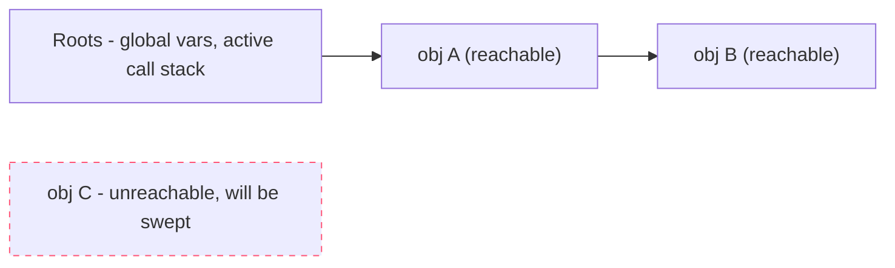

1. **Mark**: starting from the "roots" (global variables, currently-executing function scopes), the GC traverses every reference and marks all reachable objects.
2. **Sweep**: anything left unmarked is unreachable — garbage — and its memory is freed.

```js
// Common memory leaks:
// - forgotten timers/intervals that hold closures alive
// - detached DOM nodes still referenced by JS variables
// - implicit globals (forgetting `let`/`const`)
// - closures holding onto large data unnecessarily
// - event listeners never removed

let leaked = document.getElementById("el");
document.body.removeChild(leaked); // removed from the page, but STILL in memory —
                                     // the `leaked` variable still references it
```

---

## 29. Advanced JavaScript

### Currying & Memoization

```js
const curry = fn => (...args) =>
  args.length >= fn.length ? fn(...args) : (...more) => curry(fn)(...args, ...more);

function memoize(fn) {
  const cache = new Map();
  return (...args) => {
    const key = JSON.stringify(args);
    if (cache.has(key)) return cache.get(key);
    const result = fn(...args);
    cache.set(key, result);
    return result;
  };
}
```

### Generators & Iterators

```js
function* idGenerator() {
  let id = 1;
  while (true) yield id++;
}
const gen = idGenerator();
gen.next().value; // 1
gen.next().value; // 2
```

Generators pause execution at each `yield`, resuming only when `.next()` is called again — useful for lazy sequences and custom iteration protocols.

### Proxy & Reflect

```js
const proxy = new Proxy(user, {
  get(target, prop) {
    console.log(`Reading ${prop}`);
    return Reflect.get(target, prop);
  },
  set(target, prop, value) {
    if (prop === "age" && value < 0) throw new Error("Invalid");
    return Reflect.set(target, prop, value);
  }
});
```

A `Proxy` intercepts fundamental operations (get, set, delete...) on an object, enabling validation, logging, or reactive-data patterns (e.g. Vue's reactivity system).

### Symbols & WeakMap

```js
const id = Symbol("id"); // guaranteed unique key, hidden from Object.keys/JSON.stringify

const privateData = new WeakMap(); // keys are weakly held → allows garbage collection
class User {
  constructor(name) { privateData.set(this, { name }); }
  getName() { return privateData.get(this).name; }
}
```

### Functional Composition

```js
const compose = (...fns) => x => fns.reduceRight((acc, fn) => fn(acc), x); // right → left
const pipe = (...fns) => x => fns.reduce((acc, fn) => fn(acc), x);          // left → right
const finalPrice = pipe(withDiscount, withTax);
```

### Design Patterns — Observer / Pub-Sub

```js
class EventEmitter {
  #listeners = {};
  on(event, cb) { (this.#listeners[event] ??= []).push(cb); }
  emit(event, ...args) { this.#listeners[event]?.forEach(cb => cb(...args)); }
}
```

> **Performance tips:** use `Map`/`Set` for O(1) lookups instead of `Array.includes()` inside loops; batch DOM writes together; use `requestAnimationFrame` for animation loops; lazy-load with dynamic `import()`; debounce/throttle high-frequency event handlers.

---

## 30. Quick-Reference Cheat Sheet


| Topic                    | Key Rule                                                                                             |
| -------------------------- | ------------------------------------------------------------------------------------------------------ |
| **Memory model**         | Stack = primitives (by value) · Heap = objects (by reference)                                       |
| **Scope chain**          | Block → Function → Global                                                                          |
| **Hoisting**             | `var` → `undefined` · `let`/`const` → TDZ · function declarations → fully hoisted               |
| **`this` priority**      | `new` > `call`/`apply`/`bind` > `obj.method()` > default                                             |
| **Async priority**       | synchronous code > microtasks (Promises) > macrotasks (`setTimeout`)                                 |
| **Equality**             | Always prefer`===` / `!==` over `==` / `!=`                                                          |
| **Storage choice**       | Server needs it → Cookie · Persistent client data →`localStorage` · Tab-only → `sessionStorage` |
| **CORS**                 | Browser-enforced; fixed on the**server**, never in client JS                                         |
| **Debounce vs Throttle** | Debounce = fire once after a pause · Throttle = fire at a fixed interval                            |
| **Shallow vs Deep copy** | `{...obj}` / `Object.assign` = shallow · `structuredClone(obj)` = deep                              |

---

*End of notes — use the Table of Contents to jump between topics for quick revision.*
