# Lecture 27: CAP Theorem — Interview Prep Notes

> Notes built from the lecture content, organized with diagrams for quick revision before interviews.

---

## 1. The Real Problem (Starting Point)

Two copies of the same database:

```
DB-A = ₹300
DB-B = ₹300
```

User withdraws ₹100 through A:

```
DB-A = ₹200      DB-B = ₹300 (not yet replicated)
```

If a read hits B during this small window → it returns the **stale** ₹300. This is a  **consistency problem** , even *without* a network partition — just normal replication delay.

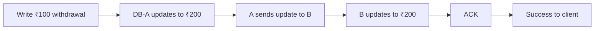

**Key line:** If the network is healthy, replication delay is manageable because A and B can still coordinate.

---

## 2. What is a Network Partition?

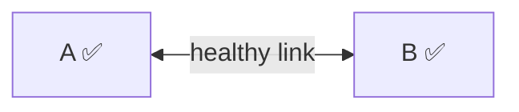

becomes:

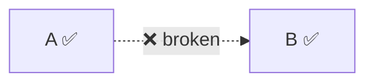

**Both nodes are alive — only communication between them is broken.**

Possible causes: router/switch failure, cable failure, firewall misconfig, routing problems, packet loss, high latency, overload, one-directional communication failure.

> ⚠️ **Partition ≠ a machine crashed.**

---

## 3. DB Crash vs Network Partition (Interview favorite — these look identical from A's view!)


|               | DB Crash                         | Network Partition                        |
| --------------- | ---------------------------------- | ------------------------------------------ |
| State         | `A ✅ B ❌`— B is actually dead | `A ✅  X  B ✅`— both alive, can't talk |
| From A's view | `A → B: hello? ... no response` | `A → B: hello? ... no response`         |

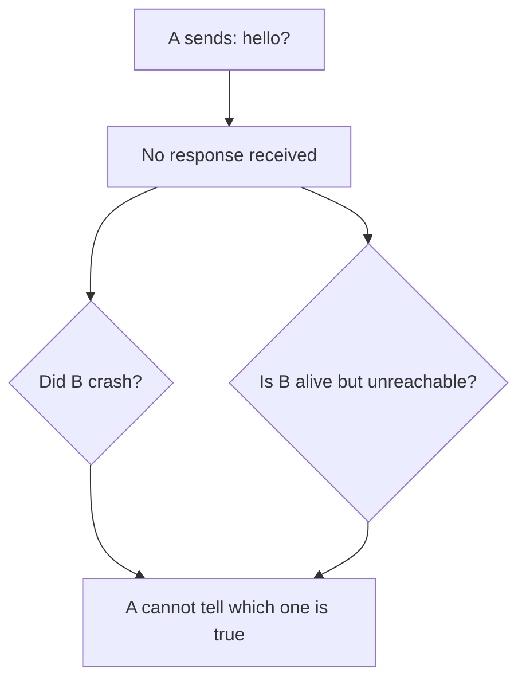

**This ambiguity is one of the core problems in distributed systems.**

---

## 4. Failure Detection via Heartbeats

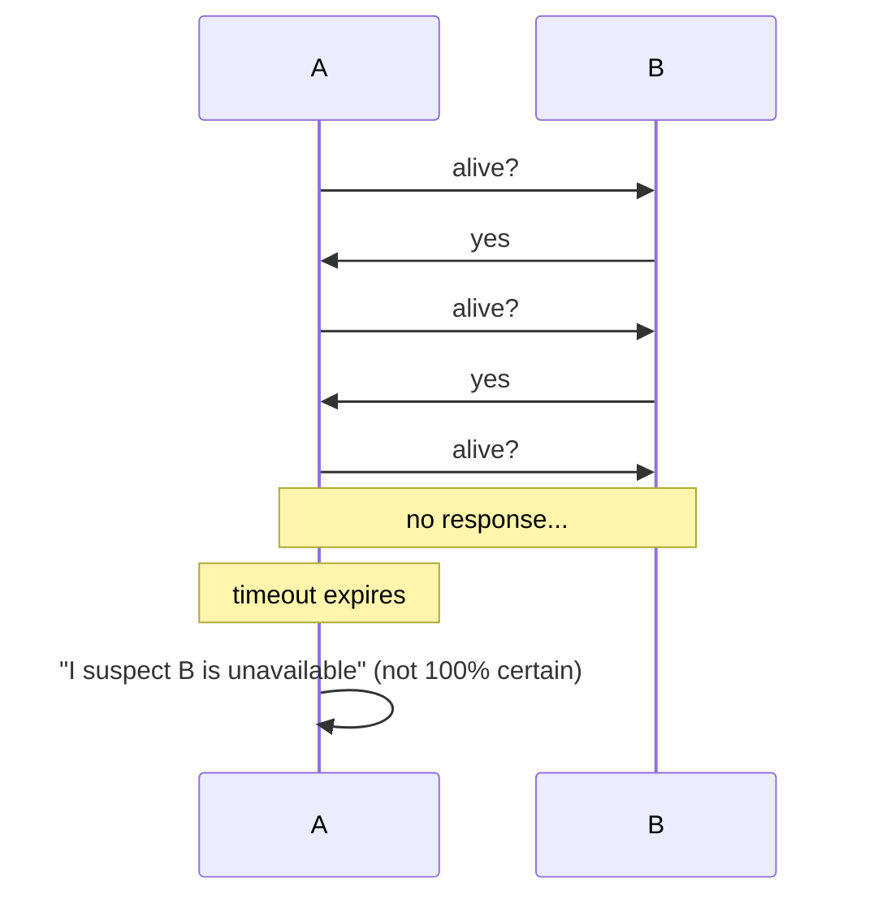

### Timeout Trade-off (classic interview question)


| Timeout | Pros                   | Cons                   |
| --------- | ------------------------ | ------------------------ |
| Small   | Fast failure detection | More false alarms      |
| Large   | Fewer false alarms     | Slow failure detection |

---

## 5–7. The Actual CAP Dilemma

Start: `A = ₹300, B = ₹300` → Partition occurs → Withdraw ₹100 request reaches  **A** , and A cannot talk to B.

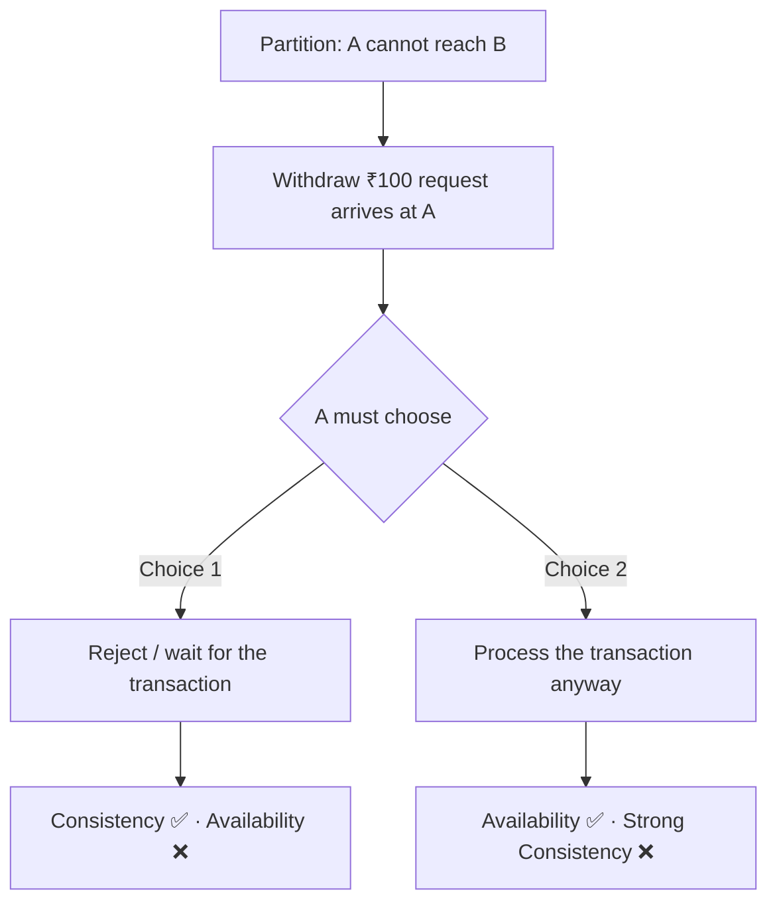

**Choice 1 — Protect Consistency (CP direction):**
`A` refuses/waits because it can't coordinate with `B`. Data stays correct, but a live, healthy node refused to serve a request.

**Choice 2 — Protect Availability (AP direction):**
`A` processes the withdrawal anyway → `A = ₹200`, while `B` still shows `₹300`. Both nodes keep responding, but their data disagrees.

---

## 8. What Does "Availability" Actually Mean?

It does **not** just mean "server is running."

> **Availability = a reachable, non-failed node keeps processing requests instead of refusing them just because another node is unreachable.**

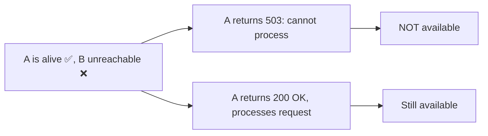

---

## 9. Does Choosing Availability Always Cause Inconsistent Data?

**No — it creates the  *possibility* , not the certainty.**

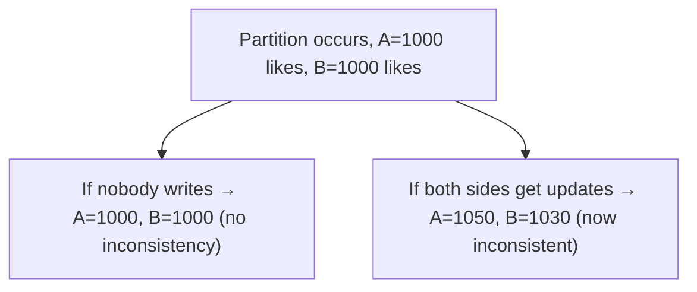

> AP means: continue serving during a partition, even though we can no longer guarantee every node holds the identical latest state.

---

## 10 & 11. Where Consistency Matters vs Where It Doesn't


| Tolerates temporary inconsistency (good for AP) | Needs strong consistency (needs CP) |
| ------------------------------------------------- | ------------------------------------- |
| Instagram likes                                 | Bank balance                        |
| YouTube views                                   | Payments                            |
| Analytics counters                              | Last airline seat                   |
| Recommendations / feeds                         | Last movie ticket                   |
| Some caches, notifications                      | Inventory of last remaining item    |

**Bank example of why CP matters here:**

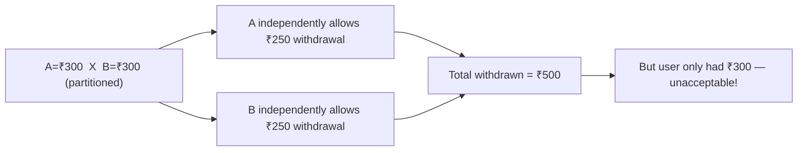

So money-critical operations usually prefer **rejecting/delaying** over risking unsafe independent decisions.

---

## 12. What Does "P" Really Mean?

`P = Partition Tolerance`

❌ Don't think of CAP as "pick any 2 of C, A, P" (CA / CP / AP) — that's an oversimplified myth.

✅ Better mental model:

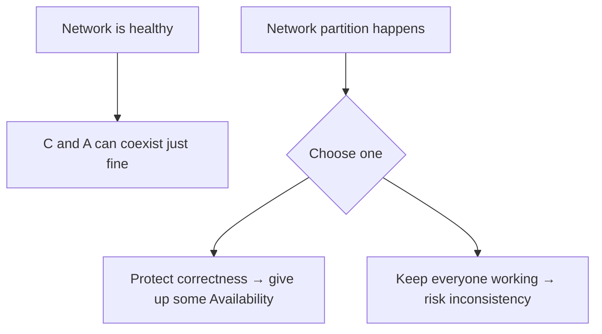

**The real CAP statement:**

> During a network partition, a distributed system cannot guarantee both strong consistency and availability simultaneously.

---

## 13. Why 2 Nodes Are Enough to Understand CAP

`A  X  B` alone already creates the full CAP dilemma:

* Both continue → Availability ✅, Consistency may break
* Both stop coordination-requiring ops → Consistency ✅, Availability ❌

**You don't need 3 nodes to understand the core trade-off.**

---

## 14. So Why Do Real Systems Use 3 Nodes? → Split-Brain Problem

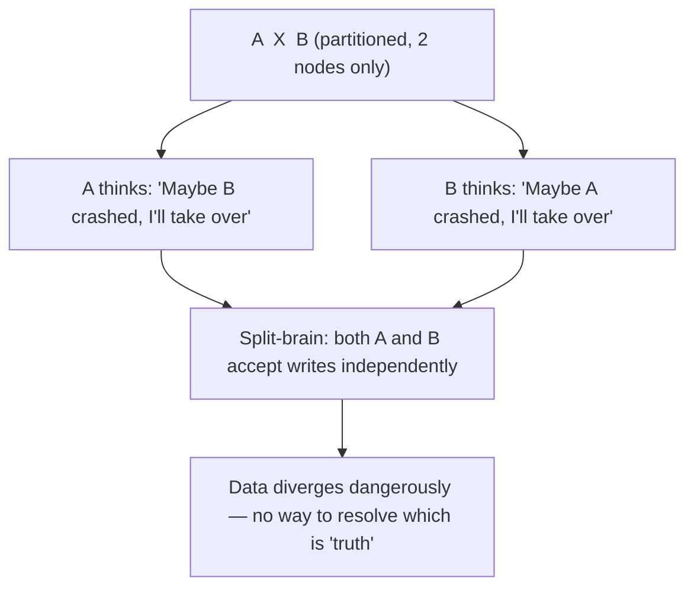

With only 2 nodes, there's no **third opinion** to break the tie.

---

## 15–16. Adding a Third Node → Quorum / Majority

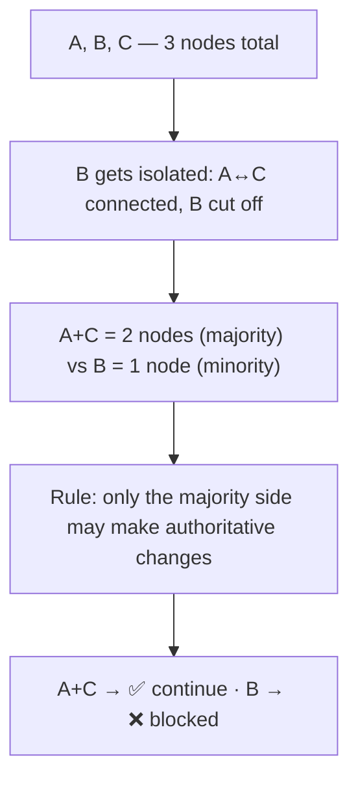

**Important:** 3 nodes did **not** defeat CAP — B is alive but denied service (Availability lost on B's side) so the majority side can safely protect Consistency. CAP still applies; quorum just gives a *safer mechanism* for deciding who continues.

---

## 17. Quorum Sizes for Common Replica Counts


| Replicas | Quorum (majority) | Failures tolerated |
| ---------- | ------------------- | -------------------- |
| 3        | 2                 | 1                  |
| 5        | 3                 | 2                  |
| 7        | 4                 | 3                  |

More replicas = more fault tolerance, but more storage, network traffic, coordination overhead, and cost.

---

## 18. Replicas vs Shards (important distinction!)

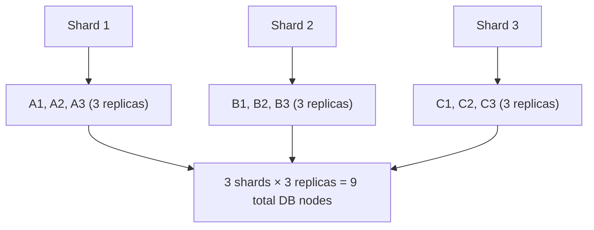

> "3 replicas" doesn't mean the whole company runs on only 3 DB servers — it means roughly 3 copies of *each* piece of replicated data.

---

## 19–20. Primary + Followers

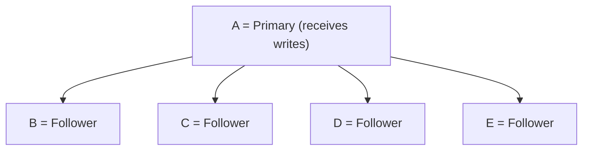

Followers give redundancy, fault tolerance, and replication — and *may* serve reads depending on consistency requirements.

**Stale read risk:**

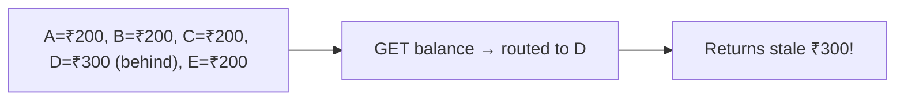

> A replica is not automatically a "safe read server" — read strategy is a separate design decision.

---

## 21. Why Majority Writes Matter

With 5 nodes, quorum = 3. If a write succeeds on A, B, C (3/5) → it's  **committed** , even if D and E haven't received it yet.

---

## 22. Replicas Store an Ordered Log (crucial concept)

Writes aren't independent values — they form an ordered history:

```
W1 → W2 → W3 → W4
```

A replica should never have `[W2]` while missing `W1` — order must be preserved.

---

## 23–24. Worked Example: 5-Node Cluster, Changing Majorities

**Setup:** A, B, C, D, E all start at ₹300. A is primary.

**Write 1** (`₹300 → ₹200`) replicates to A, B, C only:

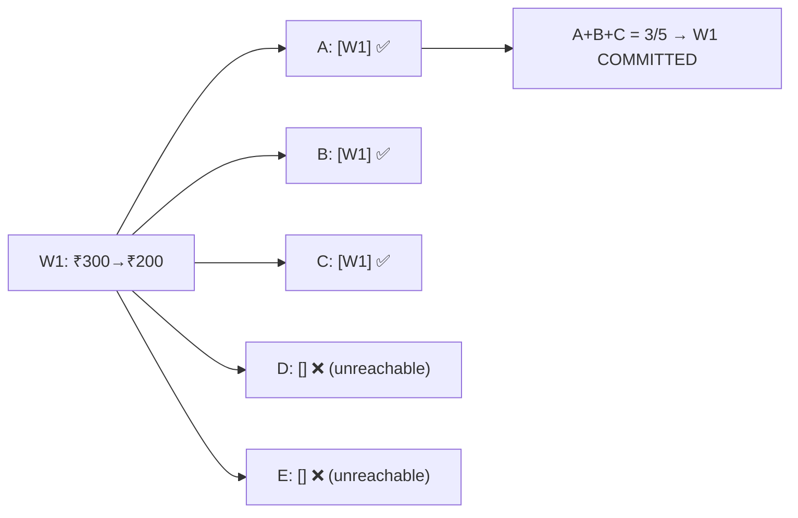

**Write 2** (`₹200 → ₹150`) — this time A can reach D and E, not B/C. A first catches D/E up with W1, *then* sends W2:

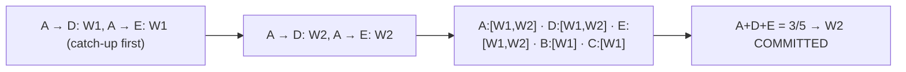

**Key insight:** Write 1's quorum was `{A,B,C}`; Write 2's quorum was `{A,D,E}` — the majority group  *changed between writes* , and that's perfectly fine.

---

## 25. A Crashes — Leader Election Must Preserve Committed History

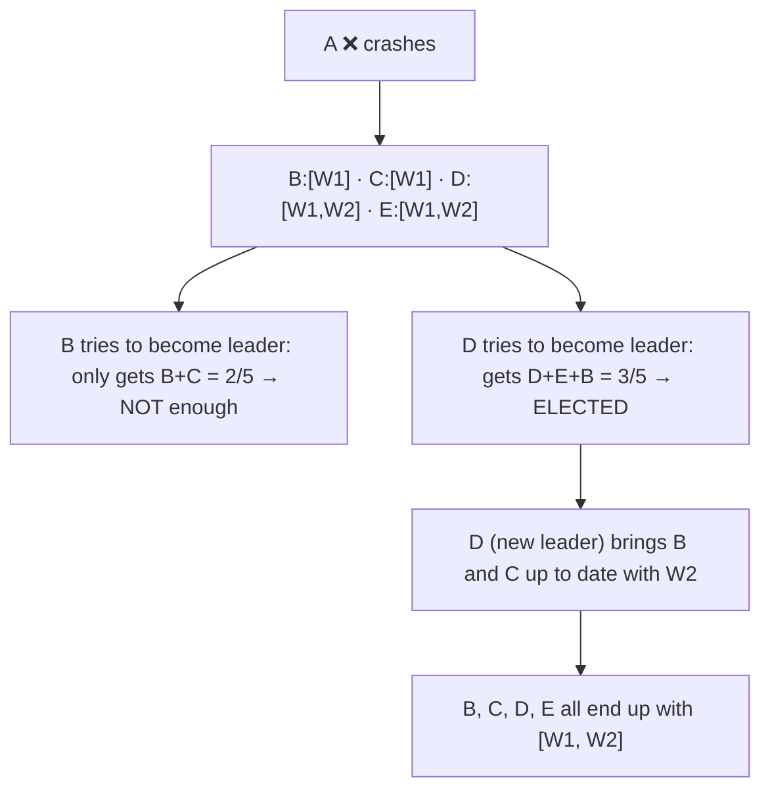

**Why this matters:** Consensus protocols prevent an out-of-date node (like B or C, missing W2) from becoming leader and silently losing committed history.

---

## 26. Quorum Intersection — Why Different Majorities Are Safe

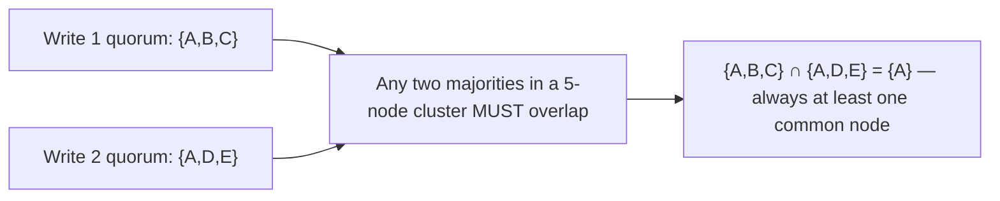

With majority = 3 out of 5, two groups of 3 can never be fully disjoint. This overlap guarantee ( **quorum intersection** ) is a foundation of consensus algorithms (e.g., Raft, Paxos).

---

## 27. If A Gets Partitioned (Instead of Crashing)

```
A (1/5, isolated)   X   B, C, D, E (4/5, majority)
```

A cannot get quorum alone, so it **cannot** safely commit new writes. The other side (4/5) can elect a new leader — likely D or E, since they hold the newest log.

---

## 28. Worst Case: Cluster Splits 2 vs 2 After a Crash

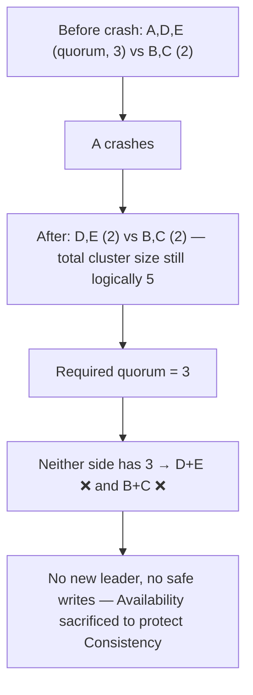

---

## 29. The Most Important Mental Model

```mermaid
flowchart TD
    Partition["Network partition occurs"] --> Q{"Should disconnected sides continue independently?"}
    Q -->|"NO"| ProtectC["Protect Consistency: reject/wait"]
    Q -->|"YES"| ProtectA["Protect Availability: risk divergence"]
    Quorum["Quorum: which side has enough members to continue safely? → majority"]
    Log["Consensus log: what history must the new leader preserve? → committed ordered log"]
```

These three ideas (CAP trade-off, quorum, consensus log) are **related but distinct** — a common interview trap is treating them as the same thing.

---

## 30. Final Distinction Table (Great for quick recall)


| Concept                 | Answers the question                                            |
| ------------------------- | ----------------------------------------------------------------- |
| **CAP**                 | What guarantee must I sacrifice during a network partition?     |
| **Quorum**              | Which group has enough members to make authoritative decisions? |
| **Leader election**     | Which node coordinates writes now?                              |
| **Replication log**     | What exact ordered history of writes must replicas preserve?    |
| **Heartbeat / timeout** | How do nodes suspect another node is unavailable?               |

---

## Quick-Fire Interview Q&A (Flashcard style)

```python
# Cover the answer, try to recall it first, then check.

Q1 = "Is a network partition the same as a node crash?"
A1 = "No. In a partition, both nodes are alive but cannot communicate; a crash means one node is actually dead. From the other node's perspective, both often look identical (no response to heartbeat)."

Q2 = "What does Availability mean in CAP, precisely?"
A2 = "A reachable, non-failed node keeps processing requests instead of refusing them just because it can't reach another node — not merely 'the server is up.'"

Q3 = "Is CAP really 'pick 2 out of 3' (CA/CP/AP)?"
A3 = "No, that's an oversimplification. C and A can coexist when the network is healthy. The trade-off only kicks in DURING a partition — then you must choose to protect either C or A."

Q4 = "Why do real systems use 3+ nodes instead of just 2?"
A4 = "To avoid the split-brain problem — with only 2 nodes, each side may independently assume the other crashed and both start accepting writes. A third node provides a tie-breaking majority (quorum)."

Q5 = "Does adding more nodes defeat CAP?"
A5 = "No. More nodes (quorum-based majority) just give a safer mechanism to decide which side may continue — the minority side still loses availability during a partition. CAP still applies."

Q6 = "What is quorum intersection, and why does it matter?"
A6 = "Any two majority groups in a cluster must share at least one common node. This guarantees that a new leader always has access to previously committed writes, preventing lost updates."

Q7 = "Give an example where AP (eventual consistency) is fine vs where CP is required."
A7 = "AP is fine for likes/views/analytics/feeds — brief disagreement is harmless and reconciles later. CP is required for bank balances, payments, and last-item inventory, where double-processing causes real harm."
```

---

## One-Line Summary (Elevator pitch for interview)

> **"CAP tells us the unavoidable trade-off during network failure — choose Consistency or Availability, not both, while a partition lasts. Quorum and consensus (like Raft/Paxos) are the engineering techniques that let real distributed databases safely decide which side continues and what history must be preserved."**

### Final Takeaways Checklist

* ✅ CAP dilemma only appears  **during a network partition** , not during normal operation
* ✅ Partition ≠ crash — but they can look identical from the other node's view
* ✅ Availability means  *serving despite unreachability* , not just "server is up"
* ✅ AP creates the *possibility* of inconsistency, not a guarantee of it
* ✅ 2 nodes are enough to understand CAP; 3+ nodes solve the split-brain problem via quorum
* ✅ Quorum = majority; any two majorities always overlap (quorum intersection)
* ✅ Replication maintains an **ordered log** — no write can be skipped in history
* ✅ More nodes ≠ CAP defeated — the minority side still sacrifices availability

---

*Prepared from Lecture 27: CAP Theorem — for interview prep & quick revision.*
