# Git Fundamentals — Interview Prep Notes

> Notes built from the lecture content and diagrams, organized for quick revision before interviews.

---

## 1. Why Does Git Exist?

Without version control, people manually create copies:

```
payment-final.java
payment-final2.java
payment-working.java
payment-final-final.java
payment-final-final-2.java
```

This is **manual version control** — it breaks down fast, especially with multiple developers on the same project.

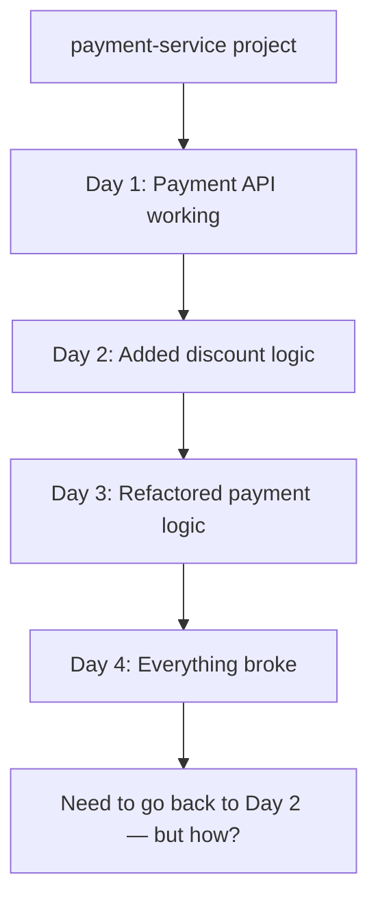

**Questions a VCS must answer:**

- Who changed a particular line? When? Why?
- What did the project look like yesterday?
- Can multiple developers work at the same time?
- Can someone experiment without breaking stable code?
- Can changes from different developers be combined?
- Can an older version be restored?

---

## 2. What Is Version Control?

> A Version Control System tracks changes to files over time so we can inspect, compare, collaborate on, and restore different versions of a project.

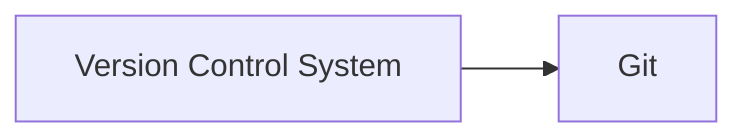

Git records meaningful versions as **commits**, instead of keeping manually duplicated folders.

---

## 3. Git vs GitHub (classic interview question — don't mix these up!)

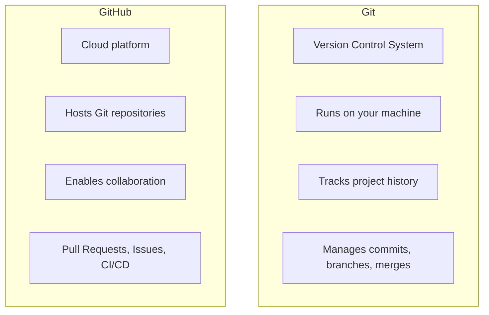

**Key line:** Git works completely on your local machine, with or without GitHub. GitHub matters when you need to share repos or collaborate.

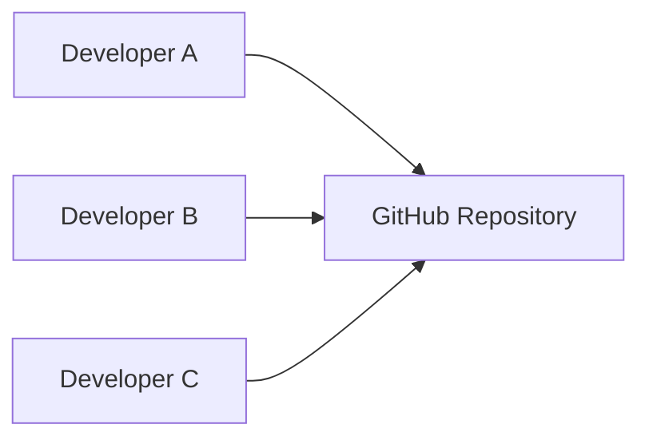

Other Git-hosting platforms: **GitLab, Bitbucket**.

---

## 4–5. Creating a Repository — `git init`

```bash
mkdir git-masterclass
cd git-masterclass
echo "Coder Army Application" > app.txt
```

At this point it's just a normal folder. Running `git status` gives:

```
fatal: not a git repository
```

Because:

```
Normal Directory ≠ Git Repository
```

Converting it:

```bash
git init
```

Now `ls -la` reveals a hidden `.git` folder — **this is what turns a directory into a Git repository.** All repo metadata, objects, references, config, and history live inside it.

---

## 6. The Most Important Git Mental Model — The 4 Areas

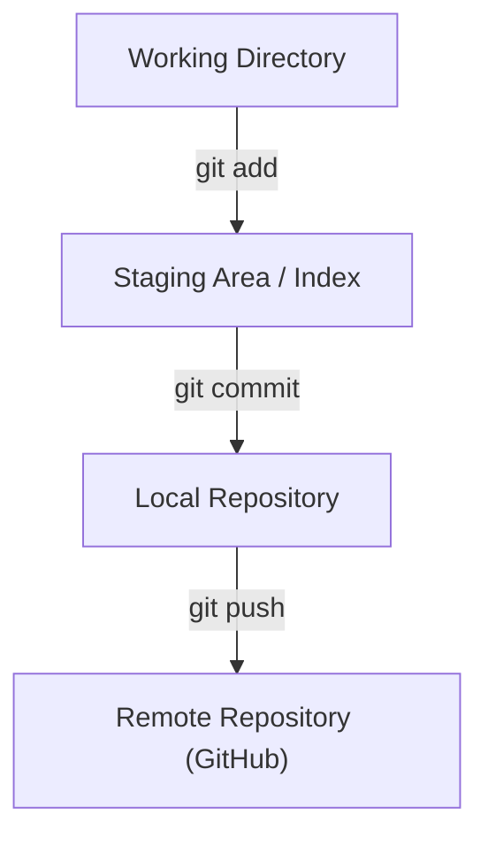

Understanding these four areas makes most Git commands click.

---

## 7. Working Directory

The project you're currently editing. Check its state with `git status`.

Two key file states for beginners:


| State         | Meaning                                                                                |
| --------------- | ---------------------------------------------------------------------------------------- |
| **Untracked** | File exists in the working directory, but Git isn't tracking it as part of history yet |
| **Staged**    | File has been selected for inclusion in the next commit                                |

---

## 8. Why Does the Staging Area Exist?

Suppose you changed three files but want only two in the next commit:

```bash
git add login.java payment.java
# README.md stays in the working directory, untouched by this commit
```

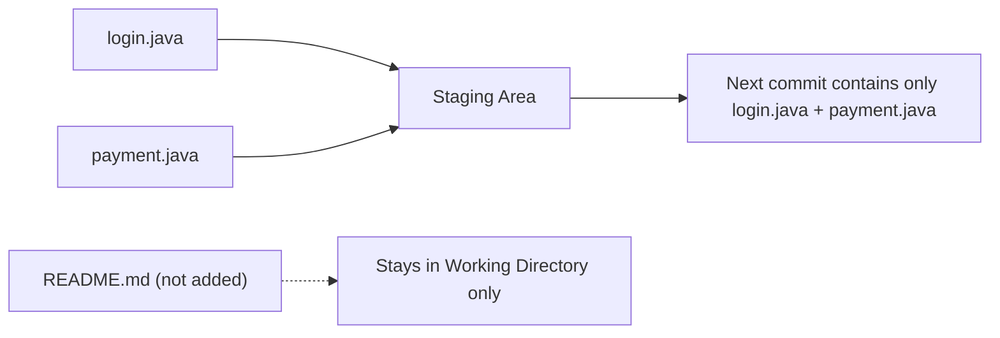

> The staging area gives you control over exactly which changes belong together in a commit.

---

## 9–10. Identity, and Creating the First Commit

```bash
git config --global user.name "Your Name"
git config --global user.email "you@example.com"

# verify
git config user.name
git config user.email
```

Then commit:

```bash
git commit -m "Initial commit"
```

A **commit** = a recorded version of the project + metadata (author, timestamp, parent commit, message).

```
commit a831c2392...
Author: ...
Date: ...
    Initial commit
```

---

## 11. Viewing History

```bash
git log
git log --oneline
```

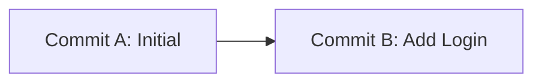

Your project now has **history**, not just a current state — this is the foundation for branching, merging, rebasing later.

---

## 12–14. Local vs Remote Repository

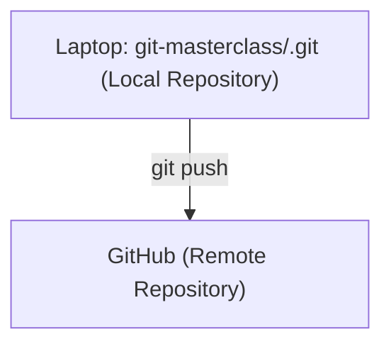

If the repo exists on only one laptop, collaboration is hard and losing the machine means losing the history — a **remote repository** solves this.

```bash
git remote add origin <repository-url>
git remote -v
git push -u origin master
```

`origin` is just the conventional name for the primary remote's URL. The `-u` flag sets an **upstream relationship**, so future `git push`/`git pull` know which remote branch to sync with.

Temporary credential caching (used in the live lecture setup):

```bash
git config --global credential.helper 'cache --timeout=14400'
# 14400 seconds = 4 hours
```

---

## 15. Cloning vs Downloading a ZIP (important distinction!)

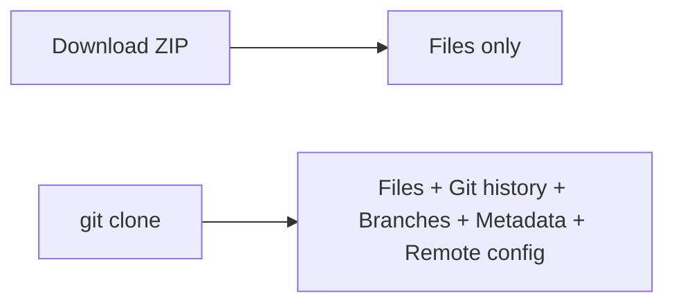

```bash
git clone <repository-url>
```

A clone gives a new developer the **entire repository**, not just a snapshot of files.

---

## 16. `git fetch` vs `git pull` — extremely important distinction

**Scenario:** remote has `A─B─C`, but your local branch only has `A─B` (someone else pushed `C`).

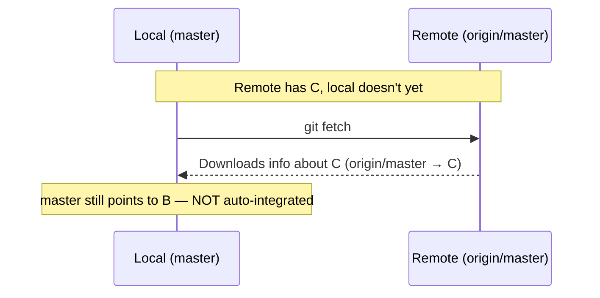

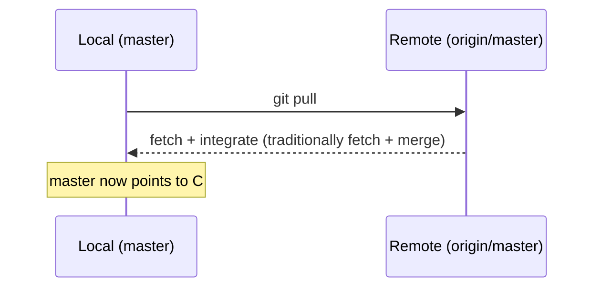


| Command     | What it does                                                                  |
| ------------- | ------------------------------------------------------------------------------- |
| `git fetch` | Downloads remote info/objects, does**not** auto-integrate into current branch |
| `git pull`  | Downloads**and** integrates (fetch + merge, conceptually)                     |

This distinction becomes critical later when learning merge and rebase.

---

## 17. Complete Local + Remote Workflow

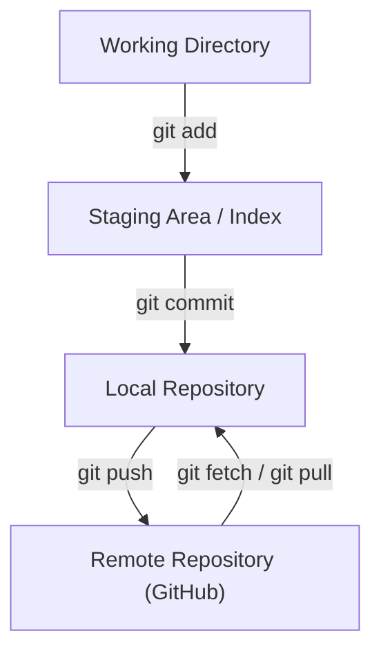

---

## 18. Git Internals — `.git` Is a Local Database

```bash
ls -la .git
```

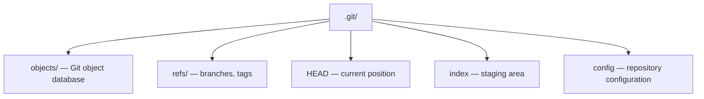

---

## 19. Git as a Content-Addressed Object Database (core internals concept)

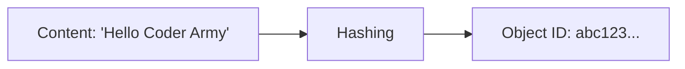

Git identifies objects by a **hash of their content** — this lets Git detect and reuse identical content efficiently.

---

## 20–21. Three Core Object Types

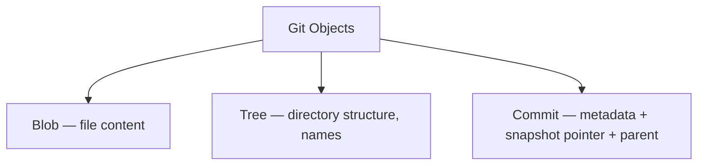

**Blob** stores file content (not the filename):

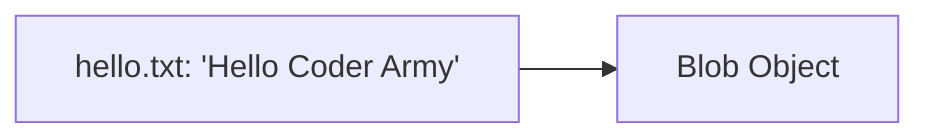

---

## 22. Inspecting a Blob — `git hash-object`

```bash
git hash-object hello.txt          # calculates ID, doesn't write it
git hash-object -w hello.txt       # -w writes the object into the DB
# Example ID: 5da7cf708a27a7b4769256a81332d7ee31bb673d
```

---

## 23. Where Loose Objects Are Stored

```
5da7cf708a27a7b4769256a81332d7ee31bb673d
  ↓ split into
5d  |  a7cf708a27a7b4769256a81332d7ee31bb673d
dir |  filename
```

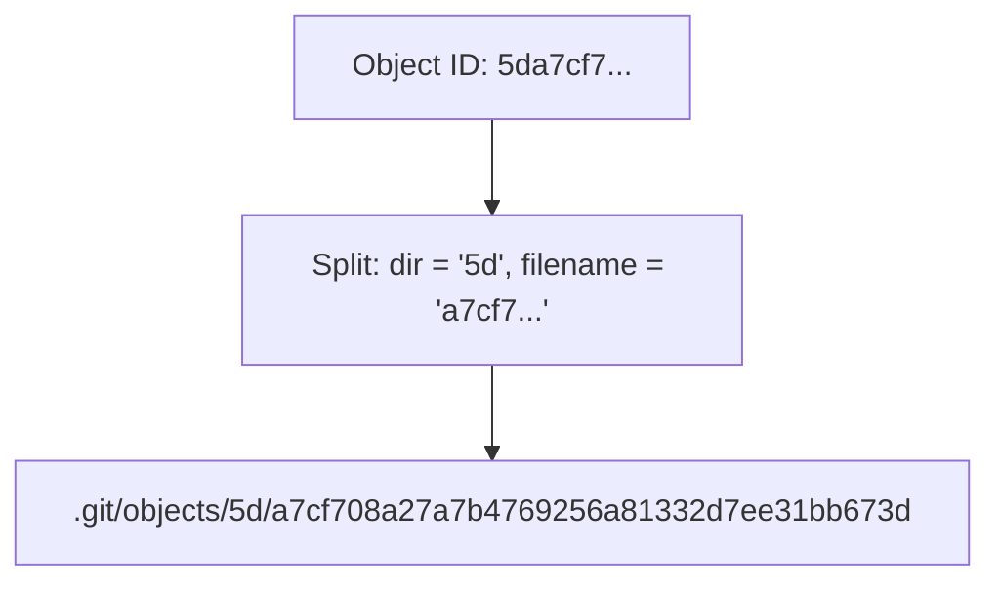

---

## 24–25. Inspecting Objects — `git cat-file`

Plain `cat` won't show readable content — Git stores objects in a compressed internal format. Use:

```bash
git cat-file -t <hash>     # -t: what TYPE is this object? (e.g. "blob")
git cat-file -p <hash>     # -p: pretty-print / display the content
```

---

## 26. What Happens Internally During `git add`?

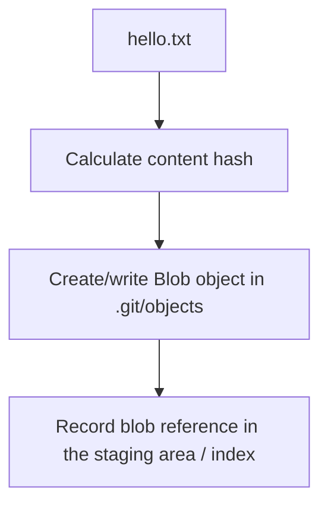

`git add` isn't just "flagging" a file — it actually creates a blob and updates the index.

---

## 27. Same Content → Same Blob ID (important principle)

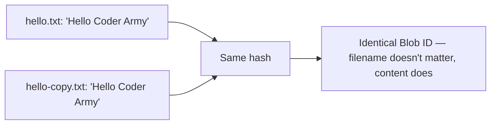

> Filename does NOT determine the Blob ID. Content determines object identity. This lets Git reuse unchanged content across commits.

---

## 28. Recovering Content Directly from a Blob

```bash
git hash-object -w hello.txt      # → 5da7cf...
rm hello.txt                       # delete the working file
git cat-file -p 5da7cf708a27a7b4769256a81332d7ee31bb673d
# original content still appears!

# reconstruct it:
git cat-file -p 5da7cf708a27a7b4769256a81332d7ee31bb673d > hello.txt
```

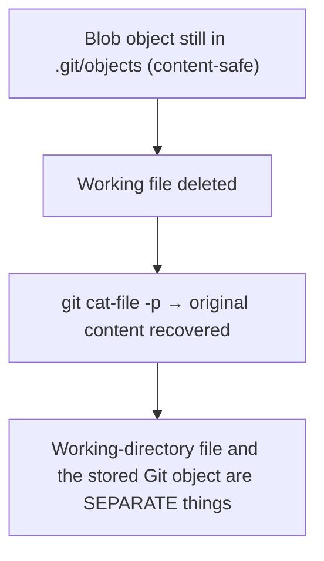

---

## 29–30. Tree Objects — Names + Directory Structure

A blob stores content, but *not* the filename or folder structure. That's the **tree's** job.

```mermaid
flowchart TD
    Tree["Tree"] --> B1["hello.txt → Blob A"]
    Tree --> B2["app.txt → Blob B"]
    Tree --> B3["src/ → Tree C (nested)"]
```

Inspecting a tree:

```bash
git ls-tree master
git ls-tree HEAD
git cat-file -p <tree-hash>
```

Example output:

```
100644 blob abc123... app.txt
100644 blob def456... hello.txt
040000 tree xyz789... src
```


| Object   | Stores                                              |
| ---------- | ----------------------------------------------------- |
| **Blob** | File content                                        |
| **Tree** | Names + directory structure + references to objects |

---

## 31–32. Commit Objects

```mermaid
flowchart TD
    Commit["Commit C"] --> Tree["Tree T (project snapshot)"]
    Tree --> B1["app.txt → Blob B1"]
    Tree --> T2["src/ → Tree T2"]
    Commit --> Parent["Parent → Commit B"]
    Commit --> Meta["Author / Committer / Timestamp / Message"]
```

Inspecting a commit:

```bash
git cat-file -p master
```

```
tree 74fd...
parent 12ab...
author Aditya <...> 178...
committer Aditya <...> 178...

Add login feature
```

**Walking the structure manually:**

```mermaid
flowchart LR
    C["Commit"] --> T["Tree"] --> B["Blob"] --> F["File Content"]
```

---

## 33. What Does a Commit Really Represent?

> A commit object records metadata, points to the root tree representing the project's snapshot, and usually points to one or more parent commits.

```mermaid
flowchart TD
    Commit["Commit"] --> Snap["Project Snapshot → Tree"]
    Snap --> Blob["Blob"]
    Snap --> SubTree["Tree"]
    Commit --> Par["Parent Commit"]
```

---

## 34. Git History Is a Graph

```mermaid
flowchart RL
    C["Commit C"] --> B["Commit B"] --> A["Commit A (no parent)"]
```

Technically pointers go **backward** (`C → B → A`), though humans usually draw it chronologically as `A─B─C`.

**Merge commits** can have **two parents** — this is how separate development lines connect.

---

## 35. Git Stores Snapshots Without Duplicating Everything

```mermaid
flowchart TD
    subgraph SnapA["Snapshot A (Tree A)"]
        A1["app.txt → Blob 1"]
        A2["README → Blob 2"]
        A3["config → Blob 3"]
    end
    subgraph SnapB["Snapshot B (Tree B)"]
        B1["app.txt → Blob 4 (NEW)"]
        B2["README → Blob 2 (reused)"]
        B3["config → Blob 3 (reused)"]
    end
```

Unchanged files keep pointing to the **same existing blob objects** — Git does not create full physical copies of the whole project for every commit.

---

## 36–37. The Staging Area = `.git/index`

> The index is Git's proposed representation of the contents of the next commit.

```bash
git ls-files --stage
```

```
100644 abc123... 0 app.txt
100644 def456... 0 hello.txt
```

Conceptually: `filename → object ID`. The index is actively **building** the content for the next commit, not just flagging files.

---

## 38. Putting the Internals Together — Full Mental Model

```mermaid
flowchart TD
    WD["Working Directory"] -->|"git add"| Index[".git/index (Staging Area)"]
    Index -->|"references blobs"| Objects[".git/objects"]
    Objects --> Blob["Blob → Content"]
    Objects --> Tree["Tree → Structure + Names"]
    Objects --> Commit["Commit → Metadata + Tree + Parent"]
```

```mermaid
flowchart LR
    Content["File Content"] --> BlobObj["Blob Object"] --> IndexRef["Index references the Blob"] --> TreeObj["Tree represents names/structure"] --> CommitObj["Commit points to Tree"] --> ParentObj["Commit points to Parent Commit"] --> History["Git History Graph"]
```

---

## 39. Important Commands Reference

```bash
# Repository Setup
git init
git status

# Identity
git config --global user.name "Your Name"
git config --global user.email "you@example.com"
git config user.name
git config user.email

# Staging and Commits
git add <file>
git add file1 file2
git commit -m "Commit message"

# History
git log
git log --oneline

# Remote Repositories
git remote add origin <repository-url>
git remote -v
git push -u origin master
git clone <repository-url>
git fetch
git pull

# Git Internals
ls -la .git
git hash-object <file>
git hash-object -w <file>
git cat-file -t <hash>
git cat-file -p <hash>
git ls-tree HEAD
git ls-tree master
git ls-files --stage
```

---

## 40. Final Mental Model

**Beginner level:**

```mermaid
flowchart TD
    Edit["Edit Files"] -->|"git add"| Stage["Stage Changes"]
    Stage -->|"git commit"| Save["Save a Version Locally"]
    Save -->|"git push"| Share["Share It Remotely"]
```

**Internal level:**

```mermaid
flowchart TD
    Content["File Content"] --> Blob["Blob"] --> Tree["Tree"] --> Commit["Commit"] --> Parent["Parent Commit"] --> History["History Graph"]
```

**Local + remote combined:**

```mermaid
flowchart TD
    WD["Working Directory"] -->|"git add"| SA["Staging Area"]
    SA -->|"git commit"| LR["Local Repository"]
    LR -->|"git push"| RR["Remote Repository"]
    RR -->|"git fetch / pull"| LR
```

Once these mental models click, later topics — branches, merge, rebase, conflicts, reset, revert — become much easier.

---

## Quick-Fire Interview Q&A (Flashcard style)

```python
# Cover the answer, try to recall it first, then check.

Q1 = "What's the difference between Git and GitHub?"
A1 = "Git is a version control system that runs locally and tracks history/commits/branches. GitHub is a cloud platform that HOSTS Git repositories and adds collaboration features (PRs, issues, CI/CD)."

Q2 = "What's the difference between git fetch and git pull?"
A2 = "git fetch downloads remote changes/objects WITHOUT integrating them into your current branch. git pull downloads AND integrates them (conceptually fetch + merge)."

Q3 = "Why does the staging area exist?"
A3 = "It lets you control exactly which changes go into the next commit — e.g., stage only 2 of 3 modified files, leaving the third out of that commit."

Q4 = "What are the three core Git object types, and what does each store?"
A4 = "Blob = file content. Tree = filenames + directory structure + references to blobs/trees. Commit = metadata (author, timestamp, message) + pointer to the root tree + pointer to parent commit(s)."

Q5 = "Does the filename determine a blob's ID?"
A5 = "No. Content determines the object ID (via hashing). Two files with identical content but different names produce the SAME blob ID — this lets Git reuse unchanged content efficiently."

Q6 = "Is cloning the same as downloading a ZIP?"
A6 = "No. A ZIP gives you only files. Cloning gives you files + full commit history + branches + Git metadata + remote configuration."

Q7 = "What does '.git' actually contain?"
A7 = "A local content-addressed object database: objects/ (blobs, trees, commits), refs/ (branches, tags), HEAD (current position), index (staging area), and config."

Q8 = "How does a merge commit differ from a normal commit?"
A8 = "A normal commit has one parent. A merge commit has TWO (or more) parents, connecting separate lines of development back together."
```

---

## One-Line Summary

> **"Git is a content-addressed object database (Blobs → Trees → Commits) wrapped in a 4-stage workflow (Working Directory → Staging Area → Local Repo → Remote Repo) that lets teams track, share, and safely restore every version of a project."**

### Final Takeaways Checklist

- ✅ Git ≠ GitHub — Git is the VCS, GitHub is a hosting/collaboration platform
- ✅ `.git` turns a normal folder into a repository; it stores everything locally
- ✅ 4 areas: Working Directory → Staging Area → Local Repo → Remote Repo
- ✅ Staging area = fine-grained control over what goes into the next commit
- ✅ `git fetch` downloads only; `git pull` downloads + integrates
- ✅ Git objects: Blob (content) → Tree (structure/names) → Commit (metadata + snapshot + parent)
- ✅ Object IDs are content hashes — identical content reuses the same blob
- ✅ Commit history is a backward-pointing graph; merge commits have 2 parents
- ✅ Git does NOT duplicate the whole project every commit — unchanged files reuse existing blobs

---

*Prepared from the Git Fundamentals lecture — for interview prep & quick revision.*
